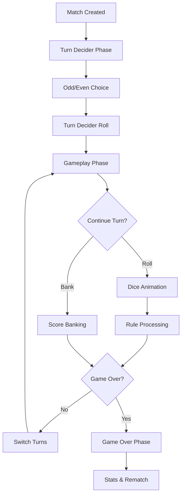

# 🎲 DashDice Game Structure & Implementation Guide

## Table of Contents
- [Overview](#overview)
- [Game Architecture](#game-architecture)
- [Game Modes](#game-modes)
- [Match System](#match-system)
- [Game Rules Engine](#game-rules-engine)
- [User Interface Components](#user-interface-components)
- [Data Flow](#data-flow)
- [Code Organization](#code-organization)

---

## Overview

DashDice is a real-time multiplayer dice game built with Next.js, TypeScript, Firebase, and Capacitor for mobile deployment. The game features multiple game modes, real-time synchronization, sophisticated dice mechanics, and AI bot opponents.

### Core Technologies
- **Frontend**: Next.js 15, TypeScript, Tailwind CSS, Framer Motion
- **Backend**: Firebase Firestore, Firebase Auth, Real-time listeners
- **Mobile**: Capacitor for iOS/Android deployment
- **Deployment**: Vercel (Web), Apple App Store & Google Play (Mobile)

---

## Game Architecture

### 🏗️ High-Level Architecture

```
┌─────────────────┐    ┌─────────────────┐    ┌─────────────────┐
│   Frontend UI   │    │   Game Logic    │    │   Data Layer    │
│                 │    │                 │    │                 │
│ • React Components │ │ • Match Service │    │ • Firebase      │
│ • Animation System │ │ • Game Mode Svc │    │ • Real-time DB  │
│ • State Management │ │ • Rules Engine  │    │ • Authentication│
└─────────────────┘    └─────────────────┘    └─────────────────┘
         │                       │                       │
         └───────────────────────┼───────────────────────┘
                                 │
                        ┌─────────────────┐
                        │   Bot System    │
                        │                 │
                        │ • AI Logic      │
                        │ • Decision Tree │
                        │ • Difficulty    │
                        └─────────────────┘
```

### 🎯 Core Components

1. **Match System** - Handles game state, player actions, real-time sync
2. **Game Mode Service** - Defines rules and configurations for different game types
3. **UI Components** - Modular React components for gameplay phases
4. **Animation Engine** - Smooth dice animations and transitions
5. **Bot System** - AI opponents with configurable difficulty

---

## Game Modes

DashDice supports multiple game modes, each with unique rules and scoring mechanisms:

### 1. 🏃 **Quickfire Mode** (`quickfire`)
*Fast-paced 50-point race*

**Configuration:**
```typescript
{
  startingScore: 0,
  targetScore: 50,
  allowBanking: true,
  scoreDirection: 'up',
  estimatedDuration: 10 // minutes
}
```

**Rules:**
- First to 50 points wins
- All standard dice rules apply
- Banking allowed for strategic play
- Double 1s (Snake Eyes): +20 points, continue turn
- Double 6s: Reset score to 0, turn ends
- Single 1: Turn ends, lose turn score

---

### 2. 🎯 **Classic Mode** (`classic`)
*Traditional 100-point race*

**Configuration:**
```typescript
{
  startingScore: 0,
  targetScore: 100,
  allowBanking: true,
  scoreDirection: 'up',
  estimatedDuration: 15 // minutes
}
```

**Rules:**
- First to 100 points wins
- Complete dice rule set with multipliers
- Banking strategy crucial for victory
- **Double Multiplier System**: Other doubles (2,2-5,5) give 2x multiplier for rest of turn

---

### 3. ⏰ **Zero Hour Mode** (`zero-hour`)
*Countdown from 100 to 0*

**Configuration:**
```typescript
{
  startingScore: 100,
  targetScore: 0,
  allowBanking: true,
  scoreDirection: 'down',
  estimatedDuration: 20 // minutes
}
```

**Unique Rules:**
- Players start at 100, race to exactly 0
- Banking **subtracts** turn score from total
- **Bust Rule**: If banking would go below 0, no score change
- **Opponent Scoring**: Some doubles give points to opponent
- **Strategic Depth**: Must land exactly on 0 to win

**Banking Logic:**
```typescript
if (currentScore - turnScore < 0) {
  // Bust! Score unchanged, turn score resets
  bankingSuccess = false;
} else if (currentScore - turnScore === 0) {
  // Victory condition!
  playerWins = true;
}
```

---

### 4. 💪 **True Grit Mode** (`true-grit`)
*One turn only, highest score wins*

**Configuration:**
```typescript
{
  startingScore: 0,
  targetScore: 999999, // No limit
  allowBanking: false,
  scoreDirection: 'up',
  eliminationRules: {
    singleOne: true // Ends turn immediately
  }
}
```

**Rules:**
- Each player gets ONE extended turn
- No banking - continuous rolling until single 1
- **Special Multipliers**: Double 1s get 7x multiplier
- **Endurance Test**: Risk vs. reward gameplay
- Highest final score wins

---

### 5. ⚡ **Last Line Mode** (`last-line`)
*Single high-stakes roll*

**Configuration:**
```typescript
{
  startingScore: 0,
  allowBanking: false,
  allowDoubleRolls: true, // Doubles grant extra rolls
  estimatedDuration: 5 // minutes
}
```

**Rules:**
- One roll per player (unless doubles)
- Doubles grant additional rolls
- Highest single-turn total wins
- Ultimate luck-based mode

---

## Match System

### 🎮 Match Lifecycle



### 📊 Match Data Structure

```typescript
interface MatchData {
  // Match metadata
  id: string;
  gameMode: string;
  createdAt: Timestamp;
  
  // Player data
  hostData: PlayerData;
  opponentData: PlayerData;
  
  // Game state
  gameData: {
    gamePhase: 'turnDecider' | 'gameplay' | 'gameOver';
    turnScore: number;
    diceOne: number;
    diceTwo: number;
    isRolling: boolean;
    hasDoubleMultiplier: boolean;
    winner?: string;
    // ... additional game state
  };
}

interface PlayerData {
  playerId: string;
  playerDisplayName: string;
  turnActive: boolean;
  playerScore: number;
  matchStats: {
    banks: number;
    doubles: number;
    biggestTurnScore: number;
    lastDiceSum: number;
  };
}
```

---

## Game Rules Engine

### 🎲 Dice Rules Processing

The game implements a sophisticated rules engine that processes every dice roll:

```typescript
// Core rule processing in MatchService.processGameRules()
const processGameRules = (dice1: number, dice2: number, gameMode: GameMode) => {
  const isDouble = dice1 === dice2;
  const rollSum = dice1 + dice2;
  
  // Rule priority order:
  if (dice1 === 1 && dice2 === 1) {
    return handleSnakeEyes(); // +20, continue turn
  }
  
  if (dice1 === 6 && dice2 === 6) {
    return handleDoubleSixes(); // Reset score, end turn
  }
  
  if (dice1 === 1 || dice2 === 1) {
    return handleSingleOne(); // End turn, lose turn score
  }
  
  if (isDouble) {
    return handleOtherDoubles(); // Activate 2x multiplier
  }
  
  return handleNormalRoll(); // Add to turn score
};
```

### 🔄 Turn Flow

1. **Dice Roll** - Player initiates roll
2. **Animation** - 1.2s slot machine animation per die
3. **Rule Processing** - Apply game mode specific rules
4. **Multiplier Check** - Apply 2x multiplier if active
5. **Player Decision** - Continue rolling or bank score
6. **Turn Resolution** - Bank score or lose turn based on rules

### 💰 Banking System

Banking converts turn score to permanent score:

```typescript
const bankScore = async (matchId: string, playerId: string) => {
  // Validate player's turn and game state
  if (!currentPlayer.turnActive || gameData.turnScore <= 0) {
    throw new Error('Cannot bank score');
  }
  
  // Apply game mode specific banking logic
  let newScore;
  if (gameMode.rules.scoreDirection === 'down') {
    // Zero Hour: subtract from score
    newScore = currentScore - turnScore;
    if (newScore < 0) {
      // Bust rule - no score change
      return { bust: true };
    }
  } else {
    // Standard: add to score
    newScore = currentScore + turnScore;
  }
  
  // Check win condition
  const hasWon = checkWinCondition(newScore, gameMode);
  
  // Update database and switch turns
  await updateMatchState({
    playerScore: newScore,
    turnScore: 0,
    turnActive: false,
    hasDoubleMultiplier: false
  });
};
```

---

## User Interface Components

### 🎨 Component Architecture

```
src/components/dashboard/
├── Match.tsx                 # Main match orchestrator
├── TurnDeciderPhase.tsx     # Odd/even choice interface
├── GameplayPhase.tsx        # Main game interface
├── GameOverPhase.tsx        # Victory screen
└── SlotMachineDice.tsx      # Animated dice component
```

### 🎰 SlotMachineDice Component

Advanced dice animation system:

```typescript
const SlotMachineDice = ({ 
  diceNumber, 
  animationState, 
  actualValue,
  isGameRolling 
}) => {
  // Progressive deceleration animation
  const [reelSpeed, setReelSpeed] = useState(50);
  
  useEffect(() => {
    if (animationState.isSpinning) {
      // Start fast, progressively slow down
      const decelerationPhases = [
        { duration: 300, speed: 50 },
        { duration: 400, speed: 100 },
        { duration: 500, speed: 200 }
      ];
      
      runDecelerationSequence(decelerationPhases);
    }
  }, [animationState.isSpinning]);
};
```

### 📱 Responsive Design

The UI adapts seamlessly between desktop and mobile:

**Desktop Layout:**
- Side-by-side player panels
- Large central dice area
- Action buttons below dice

**Mobile Layout:**
- Stacked player information
- Full-width dice display
- Fixed bottom action buttons
- Swipe gestures for chat

---

## Data Flow

### 🔄 Real-time Synchronization

```typescript
// Firebase real-time listener in Match.tsx
useEffect(() => {
  if (!matchId) return;
  
  const unsubscribe = onSnapshot(
    doc(db, 'matches', matchId),
    (doc) => {
      if (doc.exists()) {
        const newMatchData = doc.data() as MatchData;
        setMatchData(newMatchData);
        
        // Trigger animations based on state changes
        handleStateTransitions(newMatchData);
      }
    },
    (error) => {
      console.error('Match subscription error:', error);
    }
  );
  
  return unsubscribe;
}, [matchId]);
```

### 🤖 Bot Integration

AI opponents provide single-player experiences:

```typescript
const BotDecisionEngine = {
  shouldBank: (turnScore: number, playerScore: number, opponentScore: number) => {
    // Conservative strategy
    if (turnScore >= 15) return true;
    
    // Aggressive if behind
    if (opponentScore - playerScore > 20) {
      return turnScore >= 8;
    }
    
    // Risk assessment based on turn score
    return turnScore >= 12;
  },
  
  calculateDelay: () => {
    // Human-like delays
    return 1500 + Math.random() * 2000;
  }
};
```

---

## Code Organization

### 📁 Directory Structure

```
src/
├── components/
│   ├── dashboard/           # Game components
│   │   ├── Match.tsx
│   │   ├── GameplayPhase.tsx
│   │   └── SlotMachineDice.tsx
│   ├── layout/              # App layout
│   └── ui/                  # Reusable components
├── services/
│   ├── matchService.ts      # Core game logic
│   ├── gameModeService.ts   # Game mode definitions
│   └── firebase.ts          # Database configuration
├── types/
│   ├── match.ts             # Match data interfaces
│   └── gameModes.ts         # Game mode interfaces
├── context/                 # React Context providers
└── hooks/                   # Custom React hooks
```

### 🔧 Key Services

**MatchService.ts** - Core game operations
- `createMatch()` - Initialize new game
- `rollDice()` - Process dice rolls and rules
- `bankScore()` - Handle score banking
- `processGameRules()` - Apply game mode rules

**GameModeService.ts** - Game mode management
- `getGameMode()` - Fetch mode configuration
- `validateGameAction()` - Validate player actions
- Game mode definitions and rule sets

### 🎯 Performance Optimizations

1. **Optimistic Updates** - UI updates immediately, syncs later
2. **Component Memoization** - Prevent unnecessary re-renders
3. **Lazy Loading** - Components loaded on demand
4. **Animation Optimization** - Hardware-accelerated transforms
5. **Firebase Indexing** - Optimized queries for real-time data

---

## Development Guidelines

### 🚀 Getting Started

1. **Environment Setup**
```bash
npm install
npm run dev
```

2. **Firebase Configuration**
```bash
# Add your Firebase config to .env.local
NEXT_PUBLIC_FIREBASE_API_KEY=your_key
NEXT_PUBLIC_FIREBASE_PROJECT_ID=your_project
```

3. **Mobile Development**
```bash
npm run build:capacitor
npx cap sync ios
npx cap open ios
```

### 🧪 Testing

The game includes comprehensive testing for:
- Game rule validation
- Score calculation accuracy
- Real-time synchronization
- UI component behavior
- Bot decision logic

### 📚 Additional Documentation

- `MATCH_SYSTEM.md` - Detailed match implementation
- `GAME_MODE_SYSTEM.md` - Game mode specifications
- `FIREBASE_SETUP_GUIDE.md` - Backend configuration
- `DEPLOYMENT_GUIDE.md` - Production deployment

---

## Future Enhancements

### 🔮 Planned Features

1. **Tournament System** - Bracket-style competitions
2. **Achievements** - Player progression and rewards
3. **Spectator Mode** - Watch live matches
4. **Advanced Analytics** - Detailed player statistics
5. **Custom Game Modes** - User-created rule sets

### 🎨 UI/UX Improvements

1. **3D Dice Physics** - Enhanced visual feedback
2. **Voice Chat** - Real-time communication
3. **Gesture Controls** - Advanced mobile interactions
4. **Accessibility** - Screen reader and keyboard support

---

*Last Updated: October 3, 2025*
*DashDice Version: 1.0.1*