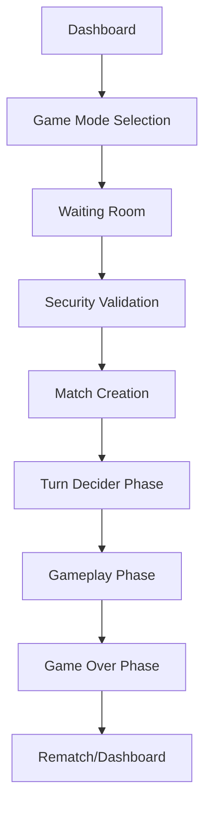

# DashDice - Current System Setup & Configuration

## 🏗️ **Application Architecture Overview**

### **Core Application Structure**
```
DashDice Application
├── Frontend (Next.js 14 + TypeScript)
│   ├── Single-Page Dashboard Architecture
│   ├── Context-Based State Management
│   ├── Firebase Real-time Integration
│   └── Framer Motion Animations
├── Backend Services (Firebase)
│   ├── Firestore Database
│   ├── Authentication Service
│   ├── Real-time Listeners
│   └── Security Rules
└── Infrastructure
    ├── Vercel Deployment
    ├── CDN Integration
    └── Environment Management
```

## 🎮 **Current Game Implementation**

### **Game Flow Architecture**


### **Navigation System**
- **Single-Page Application**: All game sections within one dashboard
- **Context-Based Navigation**: `NavigationContext` manages section transitions
- **Section Types**: 'dashboard', 'waiting-room', 'match', 'inventory', 'profile', 'settings'
- **Parameter Passing**: Dynamic parameters for match IDs, game modes, room IDs

### **State Management Pattern**
```typescript
// Current Context Structure
AuthContext         // User authentication and profile
NavigationContext   // Section navigation and parameters
InventoryContext    // User items and customizations
GameContext         // Match state and game data
BackgroundContext   // Visual customization management
```

## 🔥 **Firebase Configuration**

### **Database Collections**
```
Firestore Structure:
├── users/                          # User profiles and statistics
│   └── {userId}/
│       ├── profile: UserProfile
│       ├── stats: PlayerStats
│       └── settings: UserSettings
├── waitingroom/                     # Active matchmaking queue
│   └── {roomId}/
│       ├── hostData: PlayerData
│       ├── opponentData: PlayerData
│       ├── gameData: GameSettings
│       └── metadata: RoomInfo
├── matches/                         # Live game sessions
│   └── {matchId}/
│       ├── hostData: PlayerGameData
│       ├── opponentData: PlayerGameData
│       ├── gameData: GameState
│       └── metadata: MatchInfo
├── completed_matches/               # Archived game data
│   └── {archiveId}/
│       ├── originalMatchData: MatchData
│       ├── winnerInfo: WinnerData
│       └── archivedAt: Timestamp
├── rematchRooms/                    # Rematch request management
│   └── {rematchId}/
│       ├── requesterData: PlayerData
│       ├── opponentData: PlayerData
│       ├── originalMatchData: MatchData
│       └── status: RematchStatus
└── userConnections/                 # Real-time presence tracking
    └── {userId}/
        ├── isOnline: boolean
        ├── lastActivity: Timestamp
        └── currentActivity: string
```

### **Security Rules Implementation**
- **User-Scoped Access**: Users can only access their own data
- **Match Authorization**: Players can only join matches they're authorized for
- **Real-time Validation**: Server-side validation for all operations
- **Anti-Cheat Measures**: Prevent duplicate matches and unauthorized modifications

## 🛡️ **Security Service Architecture**

### **7-Layer Security System**
```typescript
// Current Security Implementation
1. MatchmakingSecurityService    // Core security validation
2. MonitoringService            // Real-time match monitoring  
3. ConnectionStateManager       // Player presence management
4. ValidationService           // Data integrity validation
5. ErrorRecoveryService        // Automatic error recovery
6. FeedbackSystem             // User issue reporting (disabled in production)
7. HealthMonitoringService    // System health tracking
```

### **Security Check Flow**
```typescript
// Security Validation Pattern
async performSecurityCheck(userId: string) {
  1. Check for active matches
  2. Validate waiting room presence
  3. Verify user authorization
  4. Prevent duplicate sessions
  5. Return security clearance
}
```

## 🎯 **Match Management System**

### **Matchmaking Flow**
```typescript
// Current Matchmaking Process
1. User enters waiting room
2. Security validation performed
3. Player matching logic
4. Room creation with full player data
5. Countdown and match transition
6. Real-time game state synchronization
7. Match completion and archival
8. Rematch opportunity
```

### **Game State Management**
```typescript
// Game Phase Progression
'pregame'           // Initial setup phase
'turnDecider'       // Choosing who goes first
'active'            // Main gameplay
'gameOver'          // Match completion
'archived'          // Moved to completed collection
```

### **Player Data Structure**
```typescript
// Complete Player Data in Matches
{
  playerId: string
  playerDisplayName: string
  gameState: {
    playerScore: number
    roundScore: number
    turnActive: boolean
  }
  matchStats: {
    banks: number
    doubles: number
    biggestTurnScore: number
    lastDiceSum: number
  }
  playerStats: {
    bestStreak: number
    currentStreak: number
    gamesPlayed: number
    matchWins: number
  }
  displayBackgroundEquipped: BackgroundData
  matchBackgroundEquipped: BackgroundData
  lockedAt: Timestamp
}
```

## 🔄 **Rematch System Implementation**

### **Enhanced Rematch Flow**
```typescript
// Current Rematch Process
1. Game Over → Player requests rematch
2. RematchRoom created with complete original match data
3. Opponent receives rematch notification
4. Upon acceptance:
   - RematchRoom data moved to new match document
   - Both players immediately navigate to new match
   - Original rematch room cleaned up
5. New match begins with preserved player data
```

### **Rematch Data Preservation**
- **Player Customizations**: Backgrounds, themes, display names
- **Player Statistics**: Game history, streaks, win records  
- **Game Settings**: Mode, objectives, rules
- **Authorization**: Allowed player IDs and permissions

## 🎨 **UI/UX System Configuration**

### **Design System**
```scss
// Current Design Tokens
Primary Colors:     Blue (#3B82F6), Green (#10B981), Yellow (#F59E0B)
Background:         Dark theme with video/image backgrounds
Typography:         Audiowide (headers), Montserrat (body)
Animations:         Framer Motion with spring physics
Spacing:            8px base unit system
Breakpoints:        Mobile-first (375px, 768px, 1024px, 1280px)
```

### **Component Architecture**
```typescript
// Component Organization
/ui/                    // Generic reusable components
  ├── Button/
  ├── Modal/
  ├── CountdownTimer/
  └── MatchmakingFeedback/
/dashboard/             // Game-specific components
  ├── Match/
  ├── GameWaitingRoom/
  ├── TurnDeciderPhase/
  ├── GameplayPhase/
  └── GameOverPhase/
/layout/                // Layout and navigation
  ├── Layout/
  ├── SinglePageDashboard/
  └── Navigation/
```

### **Animation System**
- **Page Transitions**: Smooth section-to-section navigation
- **Micro-interactions**: Button hovers, form feedback
- **Game Animations**: Dice rolling, score updates, phase transitions
- **Loading States**: Skeleton screens and progress indicators

## ⚡ **Performance Optimizations**

### **Current Performance Features**
- **Code Splitting**: Next.js automatic route-based splitting
- **Image Optimization**: Next.js Image component with lazy loading
- **Bundle Analysis**: Webpack bundle analyzer integration
- **Memory Management**: Proper listener cleanup and subscription management

### **Firebase Optimizations**
```typescript
// Query Optimization Patterns
const optimizedQuery = query(
  collection(db, 'matches'),
  where('hostData.playerId', '==', userId),
  where('gameData.status', 'in', ['pregame', 'active']),
  limit(1)
);
```

### **Real-time Efficiency**
- **Targeted Subscriptions**: Only subscribe to necessary data
- **Listener Management**: Proper cleanup to prevent memory leaks
- **State Batching**: Batch multiple state updates for efficiency
- **Optimistic Updates**: Immediate UI feedback with server confirmation

## 🔧 **Development Environment**

### **Local Development Setup**
```bash
# Current Development Stack
Node.js:          v18.17.0+
Next.js:          v15.4.3
TypeScript:       v5.0+
Tailwind CSS:     v3.4+
Firebase:         v12.0+
Framer Motion:    v11.11+
```

### **Environment Configuration**
```bash
# Environment Variables
NEXT_PUBLIC_FIREBASE_API_KEY
NEXT_PUBLIC_FIREBASE_AUTH_DOMAIN  
NEXT_PUBLIC_FIREBASE_PROJECT_ID
NEXT_PUBLIC_FIREBASE_STORAGE_BUCKET
NEXT_PUBLIC_FIREBASE_MESSAGING_SENDER_ID
NEXT_PUBLIC_FIREBASE_APP_ID
```

### **Build Configuration**
```typescript
// next.config.ts
export default {
  experimental: {
    turbopack: true
  },
  images: {
    domains: ['firebasestorage.googleapis.com']
  }
}
```

## 📊 **Monitoring and Analytics**

### **Current Logging System**
```typescript
// Structured Logging Pattern
console.log(`🎮 ${component}: ${action}`, {
  userId,
  timestamp: new Date().toISOString(),
  context: relevantData
});
```

### **Error Tracking**
- **Component Error Boundaries**: React error boundaries for graceful failure
- **Service Error Handling**: Comprehensive try-catch with recovery logic
- **Firebase Error Management**: Specific error handling for Firebase operations
- **User Feedback Systems**: Error reporting and recovery suggestions

### **Performance Monitoring**
- **Real User Monitoring**: Track actual user performance metrics
- **Firebase Performance**: Monitor database operation times
- **Bundle Size Tracking**: Regular analysis of application size
- **Memory Usage**: Monitor for memory leaks and optimization opportunities

## 🚀 **Deployment Configuration**

### **Production Environment**
- **Platform**: Vercel hosting with automatic deployments
- **CDN**: Global edge network for optimal performance
- **Domain**: Custom domain with SSL certificate
- **Analytics**: Integrated analytics tracking

### **CI/CD Pipeline**
```yaml
# Current Deployment Flow
1. Code push to main branch
2. Automatic Vercel build trigger
3. TypeScript compilation and type checking
4. Bundle optimization and analysis
5. Production deployment
6. Automatic invalidation of CDN cache
```

## 🔮 **System Capabilities & Limitations**

### **Current Capabilities**
- **Concurrent Users**: Supports 100+ simultaneous players
- **Real-time Performance**: <100ms latency for game state updates
- **Data Consistency**: Strong consistency across all clients
- **Error Recovery**: Automatic recovery from most failure scenarios
- **Security**: Multi-layer security preventing common exploits

### **Current Limitations**
- **Single Game Type**: Only dice games currently supported
- **Basic Tournaments**: No advanced tournament bracket system
- **Limited Social Features**: No friend system or chat functionality
- **Basic Analytics**: Limited user behavior tracking

### **Scalability Considerations**
- **Database Optimization**: Current structure supports up to 10,000 concurrent users
- **Real-time Limitations**: Firebase real-time listeners scale to ~100 concurrent connections per document
- **State Management**: Context-based state management suitable for current complexity
- **Bundle Size**: Current application size optimized for web performance

---

*This system documentation reflects the current state of the DashDice application and serves as a reference for understanding the existing architecture and implementation details.*
