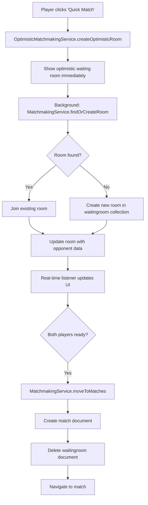
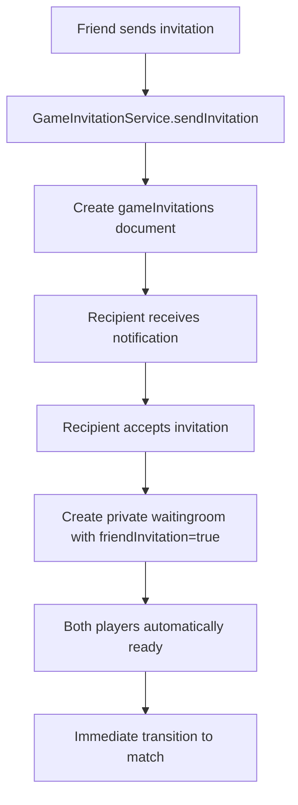
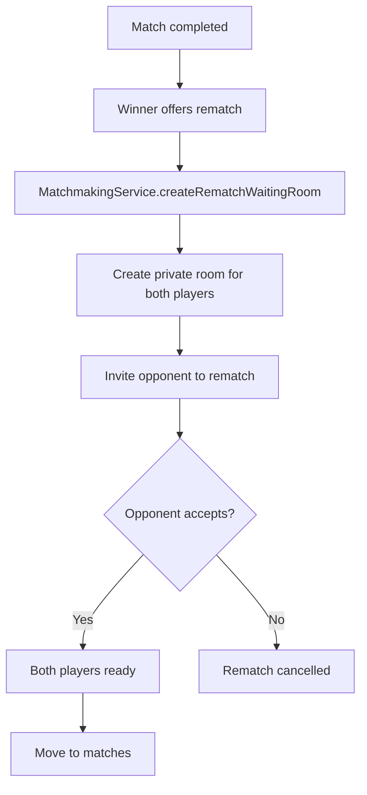

# DashDice Current Matchmaking System - Comprehensive Overview

## Table of Contents
1. [System Architecture](#system-architecture)
2. [Core Components](#core-components)
3. [Game Mode System](#game-mode-system)
4. [Firebase Collections](#firebase-collections)
5. [Matchmaking Flow](#matchmaking-flow)
6. [Service Layer](#service-layer)
7. [Real-time Systems](#real-time-systems)
8. [Security & Rules](#security--rules)
9. [Current Issues](#current-issues)
10. [System Integration](#system-integration)

---

## System Architecture

### Overview
The current DashDice matchmaking system is a multi-service architecture built on Firebase Firestore, designed to handle real-time multiplayer dice game matching. The system supports multiple game modes, friend invitations, ranked/quick matches, and rematch functionality.

### High-Level Architecture
```
┌─────────────────┐    ┌──────────────────┐    ┌─────────────────┐
│   Client UI     │    │   Service Layer  │    │   Firebase      │
│                 │    │                  │    │                 │
│ GameWaitingRoom │◄──►│ MatchmakingService│◄──►│ waitingroom     │
│ SinglePage      │    │ WaitingRoomService│    │ matches         │
│ Dashboard       │    │ GameModeService   │    │ gameSessions    │
│                 │    │ OptimisticService │    │ users           │
│                 │    │ HeartbeatService  │    │ rankedMatches   │
└─────────────────┘    └──────────────────┘    └─────────────────┘
```

---

## Core Components

### 1. Service Architecture
The system consists of multiple specialized services:

#### **MatchmakingService** (Primary)
- **Location**: `src/services/matchmakingService.ts`
- **Role**: Core matchmaking logic, room creation, player matching
- **Key Methods**:
  - `findOrCreateRoom()` - Main entry point for matchmaking
  - `createRematchWaitingRoom()` - Handles rematches between specific players
  - `moveToMatches()` - Transitions waiting room to active match
  - `addOpponentToRoom()` - Adds second player to waiting room

#### **NewMatchmakingService** (Enhanced)
- **Location**: `src/services/newMatchmakingService.ts`
- **Role**: Modern unified matchmaking with better architecture
- **Key Features**: Document cleanup, session management, improved error handling

#### **OptimisticMatchmakingService** (Step 3 & 4 Enhancement)
- **Location**: `src/services/optimisticMatchmakingService.ts`
- **Role**: Provides instant UI feedback while creating rooms in background
- **Key Features**: 
  - Bridge entry system for immediate room access
  - Optimistic UI updates
  - Enhanced heartbeat integration (15-second intervals)

#### **WaitingRoomService** 
- **Location**: `src/services/waitingRoomService.ts`
- **Role**: Waiting room document management and room state
- **Key Methods**:
  - `createRoom()` - Creates new waiting room documents
  - `findAvailableRooms()` - Searches for joinable rooms
  - `joinRoom()` / `leaveRoom()` - Player room management

#### **PlayerHeartbeatService** (Recently Enhanced)
- **Location**: `src/services/playerHeartbeatService.ts`
- **Role**: Player activity tracking and online status
- **Recent Enhancements**:
  - 15-second heartbeat frequency (increased from 30s)
  - Local tracking maps for faster status checks
  - Enhanced error handling and retry logic
  - Improved cleanup of inactive players

### 2. UI Components

#### **GameWaitingRoom Component**
- **Location**: `src/components/dashboard/GameWaitingRoom.tsx`
- **Size**: 2,400+ lines of code
- **Role**: Main waiting room interface
- **Features**:
  - Real-time player updates
  - Background rendering system
  - Game mode selection
  - Friend invitation handling
  - Optimistic UI with bridge entry system

#### **SinglePageDashboard**
- **Location**: `src/components/layout/SinglePageDashboard.tsx`
- **Role**: Navigation and section management
- **Integration**: Routes to waiting room, matches, and other game sections

---

## Game Mode System

### Supported Game Modes
The system supports 9+ game modes with different rules and configurations:

1. **Classic** - Standard dice game with traditional rules
2. **Quickfire** - Fast-paced dice action
3. **Zero Hour** - Time-based gameplay
4. **Last Line** - Final stand mechanics
5. **True Grit** - Hardcore difficulty
6. **Tag Team** - Team-based gameplay
7. **Ranked Modes** - ELO-based competitive play

### Game Mode Configuration
```typescript
interface GameMode {
  id: string;
  name: string;
  description: string;
  rules: {
    maxPlayers: number;
    roundObjective: number;
    startingScore: number;
    winCondition: string;
    specialRules: Record<string, any>;
  };
  settings: {
    timeLimit?: number;
    allowSpectators: boolean;
    isRanked: boolean;
  };
}
```

### Game Mode Service
- **Location**: `src/services/gameModeService.ts`
- **Functionality**:
  - Fetches game modes from Firestore (falls back to defaults)
  - Manages mode-specific configurations
  - Handles mode validation and initialization

---

## Firebase Collections

### 1. `waitingroom` Collection
**Primary collection for matchmaking**

```typescript
interface WaitingRoomDocument {
  id: string;                    // Auto-generated Firestore ID
  gameMode: string;             // 'quickfire', 'classic', etc.
  status: 'waiting' | 'full';   // Room status
  playersRequired: number;      // Slots remaining
  maxPlayers: number;           // Maximum capacity (usually 2)
  
  // Host player data
  hostData: {
    playerId: string;           // Firebase Auth UID
    displayName: string;        // Player display name
    avatar?: string;            // Profile avatar URL
    displayBackgroundEquipped?: BackgroundObject;
    matchBackgroundEquipped?: BackgroundObject;
    playerStats: {
      bestStreak: number;
      currentStreak: number;
      gamesPlayed: number;
      matchWins: number;
    };
    ready: boolean;
  };
  
  // Opponent data (when second player joins)
  opponentData?: {
    playerId: string;
    displayName: string;
    avatar?: string;
    displayBackgroundEquipped?: BackgroundObject;
    matchBackgroundEquipped?: BackgroundObject;
    playerStats: PlayerStats;
    ready: boolean;
  };
  
  // Game configuration
  gameData: {
    type: string;               // Game type identifier
    settings: Record<string, any>; // Mode-specific settings
    roundObjective?: number;    // Target score
    startingScore?: number;     // Starting score
  };
  
  // Metadata
  createdAt: Timestamp;
  updatedAt: Timestamp;
  expiresAt?: Timestamp;        // Auto-cleanup
  gameType?: 'quick' | 'ranked'; // Match type
  
  // Friend invitation specific
  friendInvitation?: boolean;
  invitedPlayerId?: string;
  
  // Security
  allowedPlayerIds?: string[];  // Restricted access
  lockedAt?: Timestamp;         // Room locked timestamp
}
```

**Indexes**: Currently missing dedicated indexes for waitingroom collection

### 2. `matches` Collection
**Active game matches**

```typescript
interface MatchDocument {
  id: string;
  gameMode: string;
  status: 'active' | 'paused' | 'completed';
  
  // Player authorization
  authorizedPlayers: string[];  // Player UIDs authorized to access
  
  // Host player data
  hostData: {
    playerId: string;
    displayName: string;
    playerScore: number;
    roundScore: number;
    turnActive: boolean;
    matchStats: {
      banks: number;
      doubles: number;
      biggestTurnScore: number;
      lastDiceSum: number;
    };
    // ... other player data
  };
  
  // Opponent player data
  opponentData: {
    // Same structure as hostData
  };
  
  // Game state
  gameData: {
    type: string;
    roundObjective: number;
    turnDecider: number;        // Determines first player
    diceOne: number;           // Current dice values
    diceTwo: number;
    status: 'active';
    gamePhase: 'turnDecider' | 'playing' | 'finished';
    winner?: string;           // Winner ID when completed
  };
  
  createdAt: Timestamp;
  updatedAt: Timestamp;
}
```

**Indexes**: No specific indexes currently configured

### 3. `gameSessions` Collection
**Modern session management (newer implementation)**

```typescript
interface GameSessionDocument {
  sessionId: string;
  sessionType: 'quick' | 'ranked' | 'friend';
  gameMode: string;
  status: 'waiting' | 'active' | 'completed';
  
  players: Array<{
    userId: string;
    displayName: string;
    role: 'host' | 'guest';
    joinedAt: Timestamp;
    ready: boolean;
  }>;
  
  gameSettings: {
    maxPlayers: number;
    gameMode: string;
    isPrivate: boolean;
  };
  
  createdAt: Timestamp;
  updatedAt: Timestamp;
}
```

**Indexes**: Configured for gameMode + sessionType + status + createdAt queries

### 4. `users` Collection
**Player profiles and stats**

```typescript
interface UserDocument {
  uid: string;
  displayName: string;
  email?: string;
  
  // Player statistics
  stats: {
    gamesPlayed: number;
    matchWins: number;
    bestStreak: number;
    currentStreak: number;
    totalScore: number;
    averageScore: number;
    rank?: string;
    elo?: number;
  };
  
  // Inventory and customization
  inventory: {
    displayBackgroundEquipped?: BackgroundObject;
    matchBackgroundEquipped?: BackgroundObject;
    items: Array<InventoryItem>;
  };
  
  // Online status
  isOnline?: boolean;
  lastSeen?: Timestamp;
  currentGameId?: string;      // Current match ID
  
  createdAt: Timestamp;
  updatedAt: Timestamp;
}
```

### 5. Supporting Collections

- **`rankedMatches`** - ELO-based competitive matches
- **`archivedMatches`** - Completed match history  
- **`completedmatches`** - Match results and statistics
- **`gameInvitations`** - Friend game invitations
- **`friendRequests`** - Friend system integration

---

## Matchmaking Flow

### 1. Quick Match Flow


### 2. Friend Invitation Flow


### 3. Rematch Flow


---

## Service Layer

### Key Service Relationships

#### **MatchmakingService Integration**
- **Primary matchmaking logic**
- Integrates with all other services
- Handles room lifecycle management
- Manages player data synchronization

#### **Service Dependencies**
```typescript
// MatchmakingService dependencies
import { GameModeService } from './gameModeService';
import { NewMatchmakingService } from './newMatchmakingService';
import { PlayerHeartbeatService } from './playerHeartbeatService';
import { SessionCompatibilityService } from './sessionCompatibilityService';
import { AbandonedMatchService } from './abandonedMatchService';
```

#### **Service Method Overview**
```typescript
class MatchmakingService {
  // Core matchmaking
  static async findOrCreateRoom(gameMode: string, hostData: any): Promise<string>;
  
  // Room management  
  static async addOpponentToRoom(roomId: string, opponentData: any): Promise<void>;
  static async moveToMatches(roomId: string): Promise<string>;
  
  // Specialized flows
  static async createRematchWaitingRoom(...params): Promise<string>;
  
  // Utility methods
  static getRoundObjective(gameMode: string): number;
  static getStartingScore(gameMode: string): number;
  static convertBackgroundToObject(bg: string | object): BackgroundObject;
}
```

---

## Real-time Systems

### 1. Firestore Real-time Listeners
```typescript
// GameWaitingRoom component uses onSnapshot
const unsubscribe = onSnapshot(doc(db, 'waitingroom', roomId), (doc) => {
  if (doc.exists()) {
    const data = doc.data();
    setWaitingRoomEntry(data);
    // Update UI in real-time
  }
});
```

### 2. Player Heartbeat System (Recently Enhanced)
```typescript
class PlayerHeartbeatService {
  // Enhanced features
  private static heartbeatFrequency = 15000; // 15 seconds (was 30s)
  private static activeUsers = new Set<string>();
  private static lastHeartbeatTimes = new Map<string, number>();
  
  // Key methods
  static async startHeartbeat(userId: string): Promise<void>;
  static async sendHeartbeat(userId: string): Promise<void>;
  static isUserOnline(userId: string): boolean;
  static async cleanupInactivePlayers(): Promise<void>;
}
```

### 3. Bridge Entry System (Step 3 Implementation)
```typescript
class OptimisticMatchmakingService {
  // Bridge system for immediate room access
  private static bridgeRoomData = new Map<string, any>();
  
  static setBridgeRoomData(roomId: string, roomData: any): void;
  static getBridgeRoomData(roomId: string): any | null;
  
  // Prevents race conditions when transitioning from optimistic to real rooms
}
```

---

## Security & Rules

### Firestore Security Rules

#### **Waitingroom Collection**
```javascript
// Current rules (overly permissive)
match /waitingroom/{roomId} {
  allow read, write: if request.auth != null;
}
```
**Issue**: Too broad access permissions

#### **Matches Collection**  
```javascript
match /matches/{matchId} {
  allow read, write: if request.auth != null;
}
```
**Issue**: No player-specific authorization checks

#### **Users Collection**
```javascript
match /users/{userId} {
  allow read: if request.auth != null;
  allow write: if request.auth != null; // Cross-user stats updates
}
```
**Note**: Allows cross-user updates for match statistics

### Security Concerns
1. **Overly permissive rules** - Any authenticated user can access any room
2. **No player verification** - No checks if player is authorized for specific room
3. **Missing rate limiting** - No protection against spam room creation
4. **No data validation** - Client can submit malformed data

---

## Current Issues

### 1. **Performance Issues**
- **Console Log Spam**: Infinite recursive logging was causing performance degradation
  - **Status**: FIXED - Removed problematic console.log statements from render functions
- **Inefficient Queries**: Missing Firebase indexes for waitingroom collection
- **Large Component Size**: GameWaitingRoom.tsx is 2,400+ lines

### 2. **Race Conditions** 
- **Status**: LARGELY FIXED via Step 3 Bridge Entry System
- **Room Access**: Players could access rooms that were moved to different collections
- **Data Synchronization**: Timing issues between optimistic UI and database updates

### 3. **Scalability Concerns**
- **Single Collection Bottleneck**: Heavy reliance on waitingroom collection
- **No Sharding Strategy**: All rooms in single collection
- **Limited Indexing**: Missing composite indexes for complex queries

### 4. **Architecture Issues**
- **Multiple Service Overlap**: MatchmakingService, NewMatchmakingService, WaitingRoomService have overlapping responsibilities
- **Tight Coupling**: Services heavily dependent on each other
- **Inconsistent Data Models**: Different collections use different schemas

### 5. **Security Vulnerabilities**
- **Overly Permissive Rules**: Firebase rules allow too broad access
- **No Player Authorization**: Missing checks for room access rights
- **Client-Side Validation Only**: No server-side data validation

### 6. **Game Mode Issues**
- **Firestore Dependency**: Game modes expected to be in Firestore but uses defaults
  - **Status**: NOT CRITICAL - Fallback to defaults works correctly
- **Configuration Drift**: Game mode configs can become inconsistent

---

## System Integration

### 1. **Frontend Integration**

#### **Navigation System**
- **SinglePageDashboard** manages section routing
- **NavigationContext** provides global navigation state
- **GameWaitingRoom** integrates with navigation for seamless transitions

#### **State Management**
- **AuthContext** - User authentication and profile data
- **BackgroundContext** - Player customization and inventory
- **Real-time listeners** - Direct Firestore subscriptions

### 2. **Backend Integration**

#### **Firebase Services**
```typescript
// Firebase integration points
import { db } from './firebase';
import { 
  collection, addDoc, onSnapshot, updateDoc, 
  deleteDoc, doc, query, where, getDocs 
} from 'firebase/firestore';
```

#### **Service Architecture**
```
UserService ←→ MatchmakingService ←→ GameModeService
     ↓                ↓                     ↓
BackgroundContext → WaitingRoom UI → Game Logic
```

### 3. **External Systems**

#### **Achievement System**
- Matches trigger achievement progress updates
- Cross-collection updates for player statistics
- Real-time achievement notifications

#### **Friend System**  
- Friend invitations create specialized waiting rooms
- Friend-specific game modes and private matches
- Social features integration

#### **Ranking System**
- ELO calculations after match completion
- Ranked match separate collection and logic
- Leaderboard updates

---

## Firebase Indexes

### Current Index Configuration

#### **gameSessions Collection** (Configured)
```json
{
  "collectionGroup": "gameSessions",
  "fields": [
    { "fieldPath": "gameMode", "order": "ASCENDING" },
    { "fieldPath": "sessionType", "order": "ASCENDING" },
    { "fieldPath": "status", "order": "ASCENDING" },
    { "fieldPath": "createdAt", "order": "ASCENDING" }
  ]
}
```

#### **rankedMatches Collection** (Configured)
```json
{
  "collectionGroup": "rankedMatches", 
  "fields": [
    { "fieldPath": "status", "order": "ASCENDING" },
    { "fieldPath": "createdAt", "order": "DESCENDING" }
  ]
}
```

### Missing Critical Indexes

#### **waitingroom Collection** (MISSING)
**Needed indexes for optimal performance**:
```json
{
  "collectionGroup": "waitingroom",
  "fields": [
    { "fieldPath": "gameMode", "order": "ASCENDING" },
    { "fieldPath": "status", "order": "ASCENDING" },
    { "fieldPath": "playersRequired", "order": "ASCENDING" },
    { "fieldPath": "createdAt", "order": "ASCENDING" }
  ]
}
```

#### **matches Collection** (MISSING)
```json
{
  "collectionGroup": "matches",
  "fields": [
    { "fieldPath": "status", "order": "ASCENDING" },
    { "fieldPath": "gameMode", "order": "ASCENDING" },
    { "fieldPath": "createdAt", "order": "DESCENDING" }
  ]
}
```

---

## Summary

### System Strengths
1. **Real-time capabilities** - Firestore listeners provide instant updates
2. **Multiple game modes** - Flexible game mode system
3. **Friend integration** - Social features well integrated  
4. **Recent optimizations** - Bridge entry system and enhanced heartbeat
5. **Comprehensive feature set** - Supports quick, ranked, friend, and rematch flows

### Critical Areas for Improvement
1. **Security tightening** - More restrictive Firebase rules needed
2. **Performance optimization** - Better indexing and query optimization
3. **Architecture consolidation** - Reduce service overlap and complexity
4. **Scalability planning** - Implement sharding and better distribution
5. **Error handling** - More robust error recovery and validation

### Next Steps for AAA-Level System
1. **Implement proper security model** with player-specific permissions
2. **Add comprehensive Firebase indexing** for all query patterns
3. **Consolidate service architecture** into more focused, single-responsibility services
4. **Add server-side validation** and rate limiting
5. **Implement horizontal scaling** with collection sharding
6. **Add comprehensive monitoring** and error tracking
7. **Optimize for high concurrency** with proper transaction handling

---

**Document Status**: Complete - Current System Analysis  
**Last Updated**: September 4, 2025  
**Next Document**: AAA Scaling Strategy & Implementation Plan
