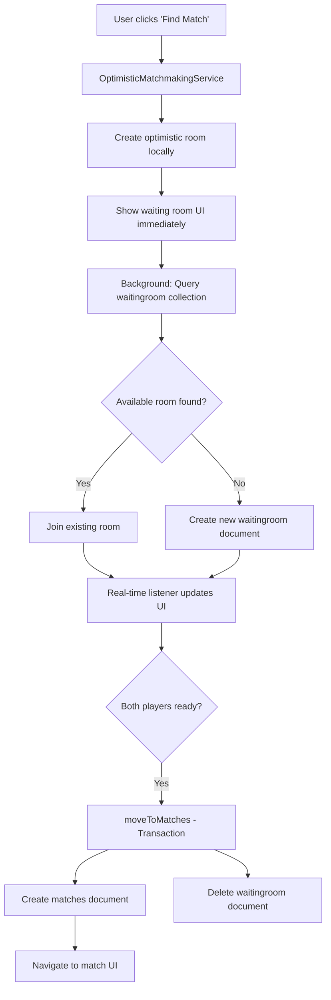

# Firebase Architecture - Comprehensive Documentation

## Table of Contents
1. [Firebase Setup & Configuration](#firebase-setup--configuration)
2. [Collection Architecture](#collection-architecture)
3. [Index Configuration](#index-configuration)
4. [Security Rules](#security-rules)
5. [Data Flow Patterns](#data-flow-patterns)
6. [Performance Considerations](#performance-considerations)
7. [Scaling Issues](#scaling-issues)
8. [Recommended Improvements](#recommended-improvements)

---

## Firebase Setup & Configuration

### Project Configuration
**Project ID**: `dashdice-firebase-project`  
**Database**: Cloud Firestore  
**Authentication**: Firebase Auth  
**Storage**: Firebase Storage (for assets)  

### Configuration Files
```typescript
// src/services/firebase.ts
import { initializeApp } from 'firebase/app';
import { getFirestore } from 'firebase/firestore';
import { getAuth } from 'firebase/auth';

const firebaseConfig = {
  apiKey: process.env.NEXT_PUBLIC_FIREBASE_API_KEY,
  authDomain: process.env.NEXT_PUBLIC_FIREBASE_AUTH_DOMAIN,
  projectId: process.env.NEXT_PUBLIC_FIREBASE_PROJECT_ID,
  storageBucket: process.env.NEXT_PUBLIC_FIREBASE_STORAGE_BUCKET,
  messagingSenderId: process.env.NEXT_PUBLIC_FIREBASE_MESSAGING_SENDER_ID,
  appId: process.env.NEXT_PUBLIC_FIREBASE_APP_ID,
};

const app = initializeApp(firebaseConfig);
export const db = getFirestore(app);
export const auth = getAuth(app);
```

### Environment Variables
```env
NEXT_PUBLIC_FIREBASE_API_KEY=...
NEXT_PUBLIC_FIREBASE_AUTH_DOMAIN=...
NEXT_PUBLIC_FIREBASE_PROJECT_ID=...
NEXT_PUBLIC_FIREBASE_STORAGE_BUCKET=...
NEXT_PUBLIC_FIREBASE_MESSAGING_SENDER_ID=...
NEXT_PUBLIC_FIREBASE_APP_ID=...
```

---

## Collection Architecture

### Primary Collections Overview
```
Firebase Database (Cloud Firestore)
├── users/                      # Player profiles and stats
├── waitingroom/                # Active matchmaking rooms
├── matches/                    # Active game matches  
├── gameSessions/               # Modern session management
├── rankedMatches/              # ELO-based competitive matches
├── archivedMatches/            # Completed match history
├── completedmatches/           # Match results (legacy)
├── gameInvitations/            # Friend game invitations
├── friendRequests/             # Friend system
├── gameModes/                  # Game mode configurations (empty)
├── achievementDefinitions/     # Achievement templates
├── userAchievements/           # Player achievements
├── achievementProgress/        # Achievement tracking
├── chatMessages/               # In-game chat
├── userChatSettings/           # Chat preferences
├── presence/                   # Online status tracking
└── globalStats/                # System-wide statistics
```

---

## Collection Detailed Schemas

### 1. `users` Collection
**Purpose**: Player profiles, statistics, inventory, and account data

```typescript
interface UserDocument {
  // Identity
  uid: string;                  // Firebase Auth UID (document ID)
  email: string;
  displayName: string;
  createdAt: Timestamp;
  updatedAt: Timestamp;
  
  // Profile
  avatar?: string;              // Profile picture URL
  bio?: string;                 // Player biography
  level: number;                // Player level
  experience: number;           // XP points
  
  // Game Statistics
  stats: {
    gamesPlayed: number;        // Total games played
    matchWins: number;          // Games won
    matchLosses: number;        // Games lost
    bestStreak: number;         // Longest win streak
    currentStreak: number;      // Current win streak
    totalScore: number;         // Lifetime score
    averageScore: number;       // Average score per game
    highestScore: number;       // Single game high score
    bankingFrequency: number;   // How often player banks
    riskTolerance: number;      // Risk-taking metric
    favoriteGameMode: string;   // Most played mode
  };
  
  // Ranked System
  ranking: {
    currentRank: string;        // Bronze, Silver, Gold, etc.
    elo: number;                // ELO rating
    seasonStats: {
      wins: number;
      losses: number;
      highestRank: string;
    };
  };
  
  // Inventory & Customization
  inventory: {
    displayBackgroundEquipped?: BackgroundObject;
    matchBackgroundEquipped?: BackgroundObject;
    items: InventoryItem[];     // Owned items
    currency: number;           // In-game currency
  };
  
  // Activity Tracking
  isOnline?: boolean;
  lastSeen: Timestamp;
  currentGameId?: string;       // Current match/room ID
  heartbeatTimestamp?: Timestamp; // PlayerHeartbeatService tracking
  
  // Social Features
  friends: string[];            // Friend user IDs
  friendRequestsReceived: string[]; // Pending incoming requests
  friendRequestsSent: string[];     // Pending outgoing requests
  
  // Settings
  settings: {
    notifications: boolean;
    soundEffects: boolean;
    musicVolume: number;
    privateProfile: boolean;
    allowFriendInvites: boolean;
  };
  
  // Privacy & Moderation
  reportedBy: string[];         // Users who reported this player
  moderationFlags: string[];   // Moderation notes
  isBanned: boolean;
  banExpiresAt?: Timestamp;
}
```

**Indexes Required**:
```json
[
  {
    "collectionGroup": "users",
    "fields": [
      { "fieldPath": "isOnline", "order": "ASCENDING" },
      { "fieldPath": "lastSeen", "order": "DESCENDING" }
    ]
  },
  {
    "collectionGroup": "users", 
    "fields": [
      { "fieldPath": "stats.gamesPlayed", "order": "DESCENDING" },
      { "fieldPath": "stats.matchWins", "order": "DESCENDING" }
    ]
  }
]
```

### 2. `waitingroom` Collection  
**Purpose**: Active matchmaking rooms where players wait for opponents

```typescript
interface WaitingRoomDocument {
  // Room Identity
  id: string;                   // Firestore document ID
  createdAt: Timestamp;
  updatedAt: Timestamp;
  expiresAt?: Timestamp;        // Auto-cleanup timestamp
  
  // Room Configuration
  gameMode: string;             // 'classic', 'quickfire', etc.
  status: 'waiting' | 'full' | 'starting';
  maxPlayers: number;           // Usually 2
  playersRequired: number;      // Remaining slots (2, 1, 0)
  gameType: 'quick' | 'ranked'; // Match type
  
  // Host Player Data
  hostData: {
    playerId: string;           // Firebase Auth UID
    displayName: string;
    avatar?: string;
    
    // Customization
    displayBackgroundEquipped?: BackgroundObject;
    matchBackgroundEquipped?: BackgroundObject;
    
    // Statistics
    playerStats: {
      bestStreak: number;
      currentStreak: number;
      gamesPlayed: number;
      matchWins: number;
    };
    
    // Room State
    ready: boolean;
    joinedAt: Timestamp;
  };
  
  // Opponent Player Data (when second player joins)
  opponentData?: {
    // Same structure as hostData
    playerId: string;
    displayName: string;
    avatar?: string;
    displayBackgroundEquipped?: BackgroundObject;
    matchBackgroundEquipped?: BackgroundObject;
    playerStats: PlayerStats;
    ready: boolean;
    joinedAt: Timestamp;
  };
  
  // Game Configuration
  gameData: {
    type: string;               // Game type identifier
    settings: Record<string, any>; // Mode-specific settings
    roundObjective?: number;    // Target score from mode config
    startingScore?: number;     // Starting score from mode config
    turnDecider?: number;       // Turn order assignment
  };
  
  // Friend Invitations
  friendInvitation?: boolean;   // Is this a friend game?
  invitedPlayerId?: string;     // Specific invited player ID
  
  // Security & Access Control
  allowedPlayerIds?: string[];  // Restricted access (for friend games)
  lockedAt?: Timestamp;         // When room was locked to prevent joins
  
  // System Metadata
  sessionId?: string;           // Bridge compatibility with gameSessions
  optimisticId?: string;        // Optimistic UI tracking ID
}
```

**Critical Missing Indexes**:
```json
[
  {
    "collectionGroup": "waitingroom",
    "fields": [
      { "fieldPath": "gameMode", "order": "ASCENDING" },
      { "fieldPath": "status", "order": "ASCENDING" },
      { "fieldPath": "playersRequired", "order": "ASCENDING" },
      { "fieldPath": "createdAt", "order": "ASCENDING" }
    ]
  },
  {
    "collectionGroup": "waitingroom",
    "fields": [
      { "fieldPath": "gameType", "order": "ASCENDING" },
      { "fieldPath": "gameMode", "order": "ASCENDING" },
      { "fieldPath": "status", "order": "ASCENDING" }
    ]
  }
]
```

### 3. `matches` Collection
**Purpose**: Active game matches with real-time game state

```typescript
interface MatchDocument {
  // Match Identity
  id: string;                   // Firestore document ID
  createdAt: Timestamp;
  updatedAt: Timestamp;
  
  // Match Configuration  
  gameMode: string;
  status: 'active' | 'paused' | 'completed' | 'abandoned';
  gameType: 'quick' | 'ranked';
  
  // Player Authorization
  authorizedPlayers: string[];  // UIDs allowed to access match
  
  // Host Player State
  hostData: {
    // Identity
    playerId: string;
    displayName: string;
    avatar?: string;
    
    // Customization
    displayBackgroundEquipped?: BackgroundObject;
    matchBackgroundEquipped?: BackgroundObject;
    
    // Game State
    playerScore: number;        // Total banked score
    roundScore: number;         // Current turn score
    turnActive: boolean;        // Is it this player's turn?
    
    // Match Statistics
    matchStats: {
      banks: number;            // Number of times banked
      doubles: number;          // Doubles rolled
      biggestTurnScore: number; // Highest single turn score
      lastDiceSum: number;      // Last dice roll sum
      turnsPlayed: number;      // Total turns taken
      averageTurnScore: number; // Average per turn
    };
    
    // Historical Stats
    playerStats: {
      bestStreak: number;
      currentStreak: number;
      gamesPlayed: number;
      matchWins: number;
    };
  };
  
  // Opponent Player State
  opponentData: {
    // Same structure as hostData
    playerId: string;
    displayName: string;
    // ... all same fields as hostData
  };
  
  // Central Game State
  gameData: {
    type: 'dice';               // Game type
    roundObjective: number;     // Target score to win
    turnDecider: number;        // Starting player (1 = host, 2 = opponent)
    
    // Current Dice State
    diceOne: number;           // Last roll - die 1
    diceTwo: number;           // Last roll - die 2
    
    // Game Phase
    status: 'active';
    gamePhase: 'turnDecider' | 'playing' | 'finished';
    
    // Game Results
    winner?: string;           // Winner player ID when completed
    winCondition?: string;     // How game was won
    completedAt?: Timestamp;   // When game ended
    
    // Turn Management
    currentTurn: string;       // Current player's UID
    turnNumber: number;        // Turn counter
    turnStartedAt?: Timestamp; // When current turn began
    
    // Special Game States
    isPaused?: boolean;
    pausedBy?: string;
    pausedAt?: Timestamp;
    abandonedBy?: string;
    abandonedAt?: Timestamp;
  };
  
  // Match History (for analysis)
  moveHistory: Array<{
    playerId: string;
    action: 'roll' | 'bank' | 'forfeit';
    diceOne?: number;
    diceTwo?: number;
    scoreAdded?: number;
    timestamp: Timestamp;
  }>;
  
  // Chat Messages (embedded)
  chatMessages?: Array<{
    playerId: string;
    message: string;
    timestamp: Timestamp;
  }>;
}
```

**Required Indexes**:
```json
[
  {
    "collectionGroup": "matches",
    "fields": [
      { "fieldPath": "status", "order": "ASCENDING" },
      { "fieldPath": "gameMode", "order": "ASCENDING" },
      { "fieldPath": "createdAt", "order": "DESCENDING" }
    ]
  },
  {
    "collectionGroup": "matches",
    "fields": [
      { "fieldPath": "authorizedPlayers", "arrayConfig": "CONTAINS" },
      { "fieldPath": "status", "order": "ASCENDING" }
    ]
  }
]
```

### 4. `gameSessions` Collection
**Purpose**: Modern session management (newer implementation)

```typescript
interface GameSessionDocument {
  // Session Identity
  sessionId: string;            // Document ID
  sessionType: 'quick' | 'ranked' | 'friend' | 'tournament';
  createdAt: Timestamp;
  updatedAt: Timestamp;
  
  // Game Configuration
  gameMode: string;
  status: 'waiting' | 'active' | 'completed' | 'cancelled';
  
  // Players
  players: Array<{
    userId: string;
    displayName: string;
    role: 'host' | 'guest' | 'spectator';
    joinedAt: Timestamp;
    ready: boolean;
    disconnectedAt?: Timestamp;
    reconnectedAt?: Timestamp;
  }>;
  
  // Game Settings
  gameSettings: {
    maxPlayers: number;
    gameMode: string;
    isPrivate: boolean;
    allowSpectators: boolean;
    timeLimit?: number;
    customRules?: Record<string, any>;
  };
  
  // Session State
  currentState: {
    phase: 'lobby' | 'playing' | 'ended';
    currentPlayer?: string;
    turnNumber: number;
    gameData?: Record<string, any>;
  };
  
  // Metadata
  version: number;              // Schema version
  migrationFlags?: string[];    // Migration tracking
}
```

**Current Indexes** (Already Configured):
```json
[
  {
    "collectionGroup": "gameSessions",
    "fields": [
      { "fieldPath": "gameMode", "order": "ASCENDING" },
      { "fieldPath": "sessionType", "order": "ASCENDING" },
      { "fieldPath": "status", "order": "ASCENDING" },
      { "fieldPath": "createdAt", "order": "ASCENDING" }
    ]
  }
]
```

### 5. `rankedMatches` Collection
**Purpose**: ELO-based competitive matches with ranking implications

```typescript
interface RankedMatchDocument {
  // Identity
  id: string;
  createdAt: Timestamp;
  completedAt?: Timestamp;
  
  // Match Details
  gameMode: string;
  status: 'active' | 'completed' | 'abandoned';
  season: string;               // Ranking season identifier
  
  // Player Data with ELO
  players: Array<{
    userId: string;
    displayName: string;
    eloRating: number;          // ELO at match start
    eloChange?: number;         // ELO change from match
    newEloRating?: number;      // ELO after match
    matchResult: 'win' | 'loss' | 'draw';
    finalScore: number;
    matchStats: MatchStats;
  }>;
  
  // Match Results
  matchResults: {
    winnerId?: string;
    winCondition: string;
    duration: number;           // Match duration in seconds
    totalTurns: number;
  };
  
  // ELO Calculation Details
  eloCalculation: {
    kFactor: number;            // ELO K-factor used
    expectedScores: number[];   // Expected win probabilities
    actualScores: number[];     // Actual results (1, 0, 0.5)
    eloChanges: number[];       // ELO changes per player
  };
}
```

**Current Indexes** (Already Configured):
```json
[
  {
    "collectionGroup": "rankedMatches",
    "fields": [
      { "fieldPath": "status", "order": "ASCENDING" },
      { "fieldPath": "createdAt", "order": "DESCENDING" }
    ]
  }
]
```

### 6. `gameInvitations` Collection
**Purpose**: Friend game invitations system

```typescript
interface GameInvitationDocument {
  // Invitation Identity
  id: string;
  createdAt: Timestamp;
  expiresAt: Timestamp;         // Auto-expire invitations
  
  // Players
  fromUserId: string;           // Inviting player
  fromDisplayName: string;
  toUserId: string;             // Invited player  
  toDisplayName: string;
  
  // Game Configuration
  gameMode: string;
  gameType: 'quick' | 'ranked';
  customMessage?: string;       // Optional invitation message
  
  // Status
  status: 'pending' | 'accepted' | 'declined' | 'expired' | 'cancelled';
  respondedAt?: Timestamp;
  
  // Resulting Game
  gameId?: string;              // ID of created game if accepted
  waitingRoomId?: string;       // ID of waiting room if created
}
```

**Required Index** (Already Configured):
```json
{
  "collectionGroup": "gameInvitations",
  "fields": [
    { "fieldPath": "status", "order": "ASCENDING" },
    { "fieldPath": "toUserId", "order": "ASCENDING" },
    { "fieldPath": "createdAt", "order": "DESCENDING" }
  ]
}
```

---

## Index Configuration

### Current Index Status

#### ✅ **Configured Indexes**
1. **achievementDefinitions** - isActive + category + order
2. **friendRequests** - status + toUserId + createdAt  
3. **gameInvitations** - status + toUserId + createdAt
4. **gameSessions** - gameMode + sessionType + status + createdAt
5. **rankedMatches** - status + createdAt

#### ❌ **Missing Critical Indexes**

#### 1. waitingroom Collection (CRITICAL)
The most important missing indexes for matchmaking performance:

```json
{
  "indexes": [
    {
      "collectionGroup": "waitingroom",
      "queryScope": "COLLECTION",
      "fields": [
        { "fieldPath": "gameMode", "order": "ASCENDING" },
        { "fieldPath": "status", "order": "ASCENDING" },
        { "fieldPath": "playersRequired", "order": "ASCENDING" },
        { "fieldPath": "createdAt", "order": "ASCENDING" }
      ]
    },
    {
      "collectionGroup": "waitingroom",
      "queryScope": "COLLECTION", 
      "fields": [
        { "fieldPath": "gameType", "order": "ASCENDING" },
        { "fieldPath": "gameMode", "order": "ASCENDING" },
        { "fieldPath": "status", "order": "ASCENDING" }
      ]
    },
    {
      "collectionGroup": "waitingroom",
      "queryScope": "COLLECTION",
      "fields": [
        { "fieldPath": "expiresAt", "order": "ASCENDING" }
      ]
    }
  ]
}
```

**Why Critical**: These indexes support the core matchmaking queries:
- Find available rooms by game mode and status
- Filter by players required (joinable rooms)
- Cleanup expired rooms efficiently

#### 2. matches Collection (HIGH PRIORITY)
```json
{
  "indexes": [
    {
      "collectionGroup": "matches",
      "queryScope": "COLLECTION",
      "fields": [
        { "fieldPath": "authorizedPlayers", "arrayConfig": "CONTAINS" },
        { "fieldPath": "status", "order": "ASCENDING" },
        { "fieldPath": "updatedAt", "order": "DESCENDING" }
      ]
    },
    {
      "collectionGroup": "matches", 
      "queryScope": "COLLECTION",
      "fields": [
        { "fieldPath": "status", "order": "ASCENDING" },
        { "fieldPath": "gameMode", "order": "ASCENDING" },
        { "fieldPath": "createdAt", "order": "DESCENDING" }
      ]
    }
  ]
}
```

#### 3. users Collection (MEDIUM PRIORITY)
```json
{
  "indexes": [
    {
      "collectionGroup": "users",
      "queryScope": "COLLECTION", 
      "fields": [
        { "fieldPath": "isOnline", "order": "ASCENDING" },
        { "fieldPath": "lastSeen", "order": "DESCENDING" }
      ]
    },
    {
      "collectionGroup": "users",
      "queryScope": "COLLECTION",
      "fields": [
        { "fieldPath": "currentGameId", "order": "ASCENDING" },
        { "fieldPath": "isOnline", "order": "ASCENDING" }
      ]
    }
  ]
}
```

#### 4. gameModes Collection (LOW PRIORITY)
```json
{
  "indexes": [
    {
      "collectionGroup": "gameModes",
      "queryScope": "COLLECTION",
      "fields": [
        { "fieldPath": "isActive", "order": "ASCENDING" },
        { "fieldPath": "platforms", "arrayConfig": "CONTAINS" },
        { "fieldPath": "__name__", "order": "ASCENDING" }
      ]
    }
  ]
}
```

---

## Security Rules

### Current Security Configuration

#### **Overly Permissive Rules (SECURITY ISSUE)**
```javascript
// firestore.rules - Current problematic rules

// Too broad access
match /waitingroom/{roomId} {
  allow read, write: if request.auth != null; // ❌ Any user can access any room
}

match /matches/{matchId} {
  allow read, write: if request.auth != null; // ❌ Any user can access any match
}

match /users/{userId} {
  allow read: if request.auth != null;        // ❌ Any user can read any profile
  allow write: if request.auth != null;      // ❌ Any user can modify any profile
}
```

#### **Recommended Secure Rules**

##### 1. **waitingroom Collection Security**
```javascript
match /waitingroom/{roomId} {
  // Read: Only if user is host, opponent, or room is public
  allow read: if request.auth != null && (
    // User is the host
    resource.data.hostData.playerId == request.auth.uid ||
    // User is the opponent  
    resource.data.opponentData.playerId == request.auth.uid ||
    // Room is public and looking for players
    (resource.data.status == 'waiting' && resource.data.playersRequired > 0)
  );
  
  // Create: Authenticated users can create rooms as host
  allow create: if request.auth != null && 
    request.resource.data.hostData.playerId == request.auth.uid;
  
  // Update: Only host/opponent can update their data
  allow update: if request.auth != null && (
    // Host updating their own data
    (resource.data.hostData.playerId == request.auth.uid && 
     request.resource.data.hostData.playerId == request.auth.uid) ||
    // Opponent joining/updating
    (request.resource.data.opponentData.playerId == request.auth.uid)
  );
  
  // Delete: Only host can delete room
  allow delete: if request.auth != null && 
    resource.data.hostData.playerId == request.auth.uid;
}
```

##### 2. **matches Collection Security**  
```javascript
match /matches/{matchId} {
  // Read/Write: Only authorized players
  allow read, write: if request.auth != null && 
    request.auth.uid in resource.data.authorizedPlayers;
    
  // Create: Only if user is in authorized players list
  allow create: if request.auth != null && 
    request.auth.uid in request.resource.data.authorizedPlayers;
}
```

##### 3. **users Collection Security**
```javascript
match /users/{userId} {
  // Read: Any authenticated user (for matchmaking display)
  allow read: if request.auth != null;
  
  // Write: Only own profile OR cross-user stats during matches
  allow write: if request.auth != null && (
    // Own profile
    request.auth.uid == userId ||
    // Cross-user stats update during active match
    (exists(/databases/$(database)/documents/matches/$(request.resource.data.currentGameId)) &&
     request.auth.uid in get(/databases/$(database)/documents/matches/$(request.resource.data.currentGameId)).data.authorizedPlayers)
  );
}
```

##### 4. **gameSessions Collection Security**
```javascript
match /gameSessions/{sessionId} {
  // Read: Participants and spectators
  allow read: if request.auth != null && (
    request.auth.uid in resource.data.players.map(p => p.userId) ||
    (resource.data.gameSettings.allowSpectators == true)
  );
  
  // Write: Only participants
  allow write: if request.auth != null && 
    request.auth.uid in resource.data.players.map(p => p.userId);
}
```

---

## Data Flow Patterns

### 1. **Matchmaking Data Flow**


### 2. **Real-time Updates Pattern**
```typescript
// GameWaitingRoom component pattern
useEffect(() => {
  if (!roomId) return;
  
  // Real-time listener for room updates
  const unsubscribe = onSnapshot(
    doc(db, 'waitingroom', roomId),
    (doc) => {
      if (doc.exists()) {
        const data = doc.data();
        setWaitingRoomEntry(data);
        
        // Check if room is ready to start
        if (data.hostData?.ready && data.opponentData?.ready) {
          // Trigger match start
          handleStartMatch();
        }
      } else {
        // Room was deleted (moved to matches)
        handleRoomMoved();
      }
    },
    (error) => {
      console.error('Room listener error:', error);
      handleRoomError(error);
    }
  );
  
  return () => unsubscribe();
}, [roomId]);
```

### 3. **Transaction Patterns**
```typescript
// MatchmakingService.moveToMatches() pattern
static async moveToMatches(roomId: string): Promise<string> {
  return await runTransaction(db, async (transaction) => {
    // 1. Read room data
    const roomRef = doc(db, 'waitingroom', roomId);
    const roomSnap = await transaction.get(roomRef);
    
    if (!roomSnap.exists()) {
      throw new Error('Room not found');
    }
    
    const roomData = roomSnap.data();
    
    // 2. Create match document
    const matchRef = doc(collection(db, 'matches'));
    const matchData = await this.buildMatchData(roomData);
    transaction.set(matchRef, matchData);
    
    // 3. Update player currentGameId
    const hostRef = doc(db, 'users', roomData.hostData.playerId);
    const opponentRef = doc(db, 'users', roomData.opponentData.playerId);
    transaction.update(hostRef, { currentGameId: matchRef.id });
    transaction.update(opponentRef, { currentGameId: matchRef.id });
    
    // 4. Delete waiting room
    transaction.delete(roomRef);
    
    return matchRef.id;
  });
}
```

---

## Performance Considerations

### Current Performance Issues

#### 1. **Missing Indexes = Expensive Queries**
- **Query**: `where('gameMode', '==', mode).where('status', '==', 'waiting')`  
- **Impact**: Full collection scan on waitingroom
- **Cost**: High read costs, slow query times
- **Solution**: Add composite indexes

#### 2. **Large Document Sizes**
- **matches Documents**: Can grow large with moveHistory arrays
- **users Documents**: Large inventory arrays  
- **Impact**: Slow document reads, higher bandwidth costs
- **Solution**: Use subcollections for large arrays

#### 3. **Real-time Listener Overhead**
```typescript
// Current pattern - multiple listeners per component
useEffect(() => {
  const unsubscribe1 = onSnapshot(doc(db, 'waitingroom', roomId), callback1);
  const unsubscribe2 = onSnapshot(doc(db, 'users', userId), callback2);  
  const unsubscribe3 = onSnapshot(doc(db, 'matches', matchId), callback3);
  // Multiple active listeners...
}, [deps]);
```
**Impact**: High real-time costs, connection overhead

#### 4. **Inefficient Data Fetching**
```typescript
// Anti-pattern: Multiple individual document reads
const hostData = await getDoc(doc(db, 'users', hostId));
const opponentData = await getDoc(doc(db, 'users', opponentId));
const gameMode = await getDoc(doc(db, 'gameModes', modeId));
// Should use batch reads or optimize data structure
```

### Performance Optimizations

#### 1. **Batch Operations**
```typescript
// Optimized: Batch reads
const batch = writeBatch(db);
const hostRef = doc(db, 'users', hostId);
const opponentRef = doc(db, 'users', opponentId);

batch.update(hostRef, { currentGameId: matchId });
batch.update(opponentRef, { currentGameId: matchId });

await batch.commit();
```

#### 2. **Pagination for Lists**
```typescript
// Paginated room queries
const queryRooms = query(
  collection(db, 'waitingroom'),
  where('gameMode', '==', mode),
  where('status', '==', 'waiting'),
  orderBy('createdAt'),
  limit(20) // Paginate results
);
```

#### 3. **Subcollections for Large Data**
```typescript
// Move large arrays to subcollections
// users/{userId}/gameHistory/{gameId}
// matches/{matchId}/moves/{moveId}
// matches/{matchId}/chatMessages/{messageId}
```

---

## Scaling Issues

### Current Bottlenecks

#### 1. **Single Collection Concentration**
- **Issue**: All active matchmaking in `waitingroom` collection
- **Scale Limit**: ~10,000 concurrent rooms before performance degrades
- **Impact**: Query performance, write conflicts, hot partitions

#### 2. **No Geographic Distribution**
- **Issue**: Single global Firestore database
- **Impact**: High latency for distant players
- **Solution**: Multi-region deployment

#### 3. **Real-time Connection Limits**
- **Issue**: Each active player has multiple real-time listeners
- **Scale Limit**: Firebase has connection limits per project
- **Impact**: Connection drops, degraded UX at scale

#### 4. **Write Contention**
- **Issue**: Popular game modes create write hotspots
- **Example**: All 'quickfire' rooms compete for same indexes
- **Solution**: Distribute writes across partitions

### AAA Scaling Solutions

#### 1. **Collection Sharding**
```typescript
// Shard waitingroom by game mode + region
// waitingroom_quickfire_us_east
// waitingroom_quickfire_eu_west  
// waitingroom_classic_us_east
// etc.

const getWaitingRoomCollection = (gameMode: string, region: string): string => {
  return `waitingroom_${gameMode}_${region}`;
};
```

#### 2. **Regional Distribution**
```typescript
// Multi-region Firestore instances
const getRegionalDB = (userRegion: string) => {
  switch(userRegion) {
    case 'us-east': return getFirestore(usEastApp);
    case 'eu-west': return getFirestore(euWestApp);
    case 'asia': return getFirestore(asiaApp);
    default: return getFirestore(defaultApp);
  }
};
```

#### 3. **Connection Pooling**
```typescript
// Shared real-time connections
class RealtimeConnectionManager {
  private static connections = new Map<string, Unsubscribe>();
  
  static subscribe(path: string, callback: Function): void {
    if (!this.connections.has(path)) {
      const unsubscribe = onSnapshot(doc(db, path), (doc) => {
        // Broadcast to all subscribers
        this.notifySubscribers(path, doc);
      });
      this.connections.set(path, unsubscribe);
    }
    
    this.addSubscriber(path, callback);
  }
}
```

#### 4. **Caching Layers**
```typescript
// Redis cache for frequently accessed data
class GameModeCache {
  private static cache = new Map<string, GameMode>();
  
  static async getGameMode(modeId: string): Promise<GameMode> {
    // Check cache first
    if (this.cache.has(modeId)) {
      return this.cache.get(modeId);
    }
    
    // Fetch from Firestore
    const mode = await this.fetchFromFirestore(modeId);
    
    // Cache for 5 minutes
    this.cache.set(modeId, mode);
    setTimeout(() => this.cache.delete(modeId), 300000);
    
    return mode;
  }
}
```

---

## Recommended Improvements

### Immediate Actions (High Priority)

#### 1. **Add Critical Indexes**
```bash
# Deploy missing indexes
firebase deploy --only firestore:indexes
```

#### 2. **Implement Secure Rules**
```bash
# Update security rules  
firebase deploy --only firestore:rules
```

#### 3. **Optimize Large Documents**
- Move `moveHistory` to subcollection in matches
- Move `inventory.items` to subcollection in users
- Implement pagination for chat messages

### Medium-term Improvements

#### 1. **Collection Architecture Redesign**
- Implement regional sharding for waitingroom
- Create dedicated collections per game mode
- Add proper data partitioning strategy

#### 2. **Performance Monitoring**
```typescript
// Add performance monitoring
import { getPerformance } from 'firebase/performance';

const perf = getPerformance(app);
const trace = trace(perf, 'matchmaking-flow');
trace.start();
// ... matchmaking operations
trace.stop();
```

#### 3. **Caching Strategy**
- Implement Redis for game mode configurations
- Cache user profiles locally
- Add service worker caching for static data

### Long-term Scaling Strategy

#### 1. **Multi-region Deployment**
- Deploy Firestore in multiple regions
- Implement geographic load balancing
- Add region-aware matchmaking

#### 2. **Microservices Architecture**
- Separate matchmaking service
- Dedicated game state service  
- Independent user profile service

#### 3. **Real-time Optimization**
- WebSocket-based real-time updates
- Connection pooling and management
- Event-driven architecture

---

**Document Status**: Complete - Firebase Architecture Analysis  
**Last Updated**: September 4, 2025  
**Next Document**: Core Game Logic & System Issues
