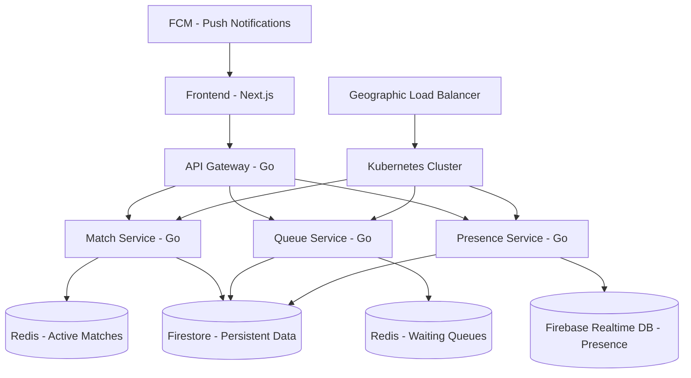

# DashDice Hybrid Matchmaking System - Complete Implementation Guide

## 📋 Table of Contents
1. [Architecture Overview](#architecture-overview)
2. [Technology Stack](#technology-stack)
3. [System Components](#system-components)
4. [Go Microservices](#go-microservices)
5. [Redis Integration](#redis-integration)
6. [Kubernetes Deployment](#kubernetes-deployment)
7. [Database Architecture](#database-architecture)
8. [Implementation Roadmap](#implementation-roadmap)
9. [Migration Strategy](#migration-strategy)
10. [Performance & Scaling](#performance--scaling)
11. [Deployment Guide](#deployment-guide)

---

## Architecture Overview

### Hybrid Multi-Database System



### System Flow Architecture

```
┌─────────────────┐    ┌──────────────────┐    ┌─────────────────┐
│   Next.js UI    │    │   Go Services    │    │  Data Storage   │
│   (Frontend)    │◄──►│   (Backend)      │◄──►│   (Hybrid)      │
├─────────────────┤    ├──────────────────┤    ├─────────────────┤
│ • Game UI       │    │ • Match Service  │    │ • Redis (Fast)  │
│ • Real-time     │    │ • Queue Service  │    │ • Firestore     │
│ • Optimistic    │    │ • Presence Svc   │    │ • Realtime DB   │
│ • Push Notifs   │    │ • API Gateway    │    │ • FCM Service   │
└─────────────────┘    └──────────────────┘    └─────────────────┘
```

---

## Technology Stack

### Backend Services (Go)
- **Go 1.21+**: Core microservices language
- **Gin**: HTTP web framework for APIs
- **Gorilla WebSocket**: Real-time connections
- **Go-Redis**: Redis client library
- **Firebase Admin SDK**: Firestore & FCM integration

### Data Storage
- **Redis Cloud**: Fast queues, active matches, caching
- **Firebase Firestore**: Persistent user data, chat, friends
- **Firebase Realtime DB**: User presence, connection status
- **Firebase Cloud Messaging**: Push notifications

### Infrastructure
- **Kubernetes**: Container orchestration and scaling
- **Docker**: Service containerization
- **NGINX Ingress**: Load balancing and SSL termination
- **Prometheus + Grafana**: Monitoring and metrics

### Frontend (Preserved)
- **Next.js 14**: Existing frontend (no changes needed)
- **TypeScript**: Type safety
- **Tailwind CSS**: Styling
- **React Context**: State management

---

## System Components

### 1. Go Microservices Architecture

```
go-services/
├── api-gateway/              # Main API entry point
│   ├── main.go
│   ├── routes/
│   ├── middleware/
│   └── handlers/
├── match-service/            # Game session management
│   ├── main.go
│   ├── game-engine/
│   ├── websocket/
│   └── redis/
├── queue-service/            # Matchmaking queues
│   ├── main.go
│   ├── matcher/
│   ├── algorithms/
│   └── redis/
├── presence-service/         # User status tracking
│   ├── main.go
│   ├── realtime/
│   └── cleanup/
├── notification-service/     # Push notifications
│   ├── main.go
│   ├── fcm/
│   └── templates/
└── shared/                   # Common utilities
    ├── config/
    ├── database/
    ├── models/
    └── utils/
```

### 2. Service Responsibilities

#### API Gateway
- **Route Management**: Proxy requests to appropriate services
- **Authentication**: JWT validation and user context
- **Rate Limiting**: Prevent abuse and ensure fair usage
- **Load Balancing**: Distribute requests across service instances

#### Match Service
- **Game State Management**: Handle active match state in Redis
- **Real-time Communication**: WebSocket connections for live gameplay
- **Rule Enforcement**: Apply game mode rules and validate moves
- **Match Recovery**: Handle disconnections and rejoins

#### Queue Service
- **Matchmaking Logic**: Find compatible opponents
- **Queue Management**: Maintain waiting room queues in Redis
- **ELO Matching**: Skill-based matchmaking for ranked games
- **Geographic Distribution**: Route players to optimal regions

#### Presence Service
- **Connection Tracking**: Monitor user online/offline status
- **Activity Updates**: Track current user activity (menu, in-game, etc.)
- **Auto Cleanup**: Remove stale presence data
- **Health Monitoring**: Detect and handle connection issues

---

## Go Microservices

### API Gateway Implementation

```go
// api-gateway/main.go
package main

import (
    "log"
    "os"
    
    "github.com/gin-gonic/gin"
    "api-gateway/routes"
    "api-gateway/middleware"
)

func main() {
    router := gin.Default()
    
    // Middleware
    router.Use(middleware.CORS())
    router.Use(middleware.Logger())
    router.Use(middleware.RateLimiter())
    
    // Health check
    router.GET("/health", func(c *gin.Context) {
        c.JSON(200, gin.H{"status": "healthy"})
    })
    
    // API routes
    v1 := router.Group("/api/v1")
    {
        routes.SetupMatchRoutes(v1)
        routes.SetupQueueRoutes(v1)
        routes.SetupPresenceRoutes(v1)
    }
    
    port := os.Getenv("PORT")
    if port == "" {
        port = "8080"
    }
    
    log.Printf("API Gateway starting on port %s", port)
    router.Run(":" + port)
}
```

```go
// api-gateway/routes/match.go
package routes

import (
    "net/http"
    "github.com/gin-gonic/gin"
    "api-gateway/services"
)

func SetupMatchRoutes(rg *gin.RouterGroup) {
    matches := rg.Group("/matches")
    {
        matches.POST("/create", createMatch)
        matches.GET("/:id", getMatch)
        matches.POST("/:id/roll", rollDice)
        matches.POST("/:id/bank", bankScore)
        matches.WS("/:id/ws", handleWebSocket)
    }
}

func createMatch(c *gin.Context) {
    var req CreateMatchRequest
    if err := c.ShouldBindJSON(&req); err != nil {
        c.JSON(400, gin.H{"error": err.Error()})
        return
    }
    
    // Forward to match service
    match, err := services.MatchService.CreateMatch(&req)
    if err != nil {
        c.JSON(500, gin.H{"error": err.Error()})
        return
    }
    
    c.JSON(201, match)
}
```

### Match Service Implementation

```go
// match-service/main.go
package main

import (
    "log"
    "os"
    
    "github.com/gin-gonic/gin"
    "match-service/handlers"
    "match-service/redis"
    "match-service/websocket"
)

func main() {
    // Initialize Redis connection
    redisClient, err := redis.NewClient()
    if err != nil {
        log.Fatal("Failed to connect to Redis:", err)
    }
    
    // Initialize WebSocket hub
    wsHub := websocket.NewHub()
    go wsHub.Run()
    
    router := gin.Default()
    
    // Initialize handlers with dependencies
    matchHandler := handlers.NewMatchHandler(redisClient, wsHub)
    
    // Routes
    router.POST("/matches", matchHandler.CreateMatch)
    router.GET("/matches/:id", matchHandler.GetMatch)
    router.POST("/matches/:id/roll", matchHandler.RollDice)
    router.POST("/matches/:id/bank", matchHandler.BankScore)
    router.GET("/matches/:id/ws", matchHandler.HandleWebSocket)
    
    port := os.Getenv("PORT")
    if port == "" {
        port = "8081"
    }
    
    log.Printf("Match Service starting on port %s", port)
    router.Run(":" + port)
}
```

```go
// match-service/handlers/match.go
package handlers

import (
    "encoding/json"
    "fmt"
    "math/rand"
    "net/http"
    "strconv"
    "time"
    
    "github.com/gin-gonic/gin"
    "github.com/go-redis/redis/v8"
    "match-service/models"
    "match-service/websocket"
)

type MatchHandler struct {
    redis *redis.Client
    wsHub *websocket.Hub
}

func NewMatchHandler(redisClient *redis.Client, wsHub *websocket.Hub) *MatchHandler {
    return &MatchHandler{
        redis: redisClient,
        wsHub: wsHub,
    }
}

func (h *MatchHandler) CreateMatch(c *gin.Context) {
    var req models.CreateMatchRequest
    if err := c.ShouldBindJSON(&req); err != nil {
        c.JSON(400, gin.H{"error": err.Error()})
        return
    }
    
    // Generate match ID
    matchID := generateMatchID()
    
    // Initialize match state
    match := &models.MatchState{
        ID:          matchID,
        GameMode:    req.GameMode,
        Players:     req.Players,
        Status:      "active",
        CurrentTurn: req.Players[0],
        Scores:      make(map[string]int),
        CreatedAt:   time.Now(),
    }
    
    // Initialize player scores based on game mode
    for _, playerID := range req.Players {
        switch req.GameMode {
        case "zero-hour":
            match.Scores[playerID] = 100
        case "last-line":
            match.Scores[playerID] = 50
        default:
            match.Scores[playerID] = 0
        }
    }
    
    // Store in Redis
    matchData, _ := json.Marshal(match)
    err := h.redis.Set(c, fmt.Sprintf("match:%s", matchID), matchData, time.Hour*2).Err()
    if err != nil {
        c.JSON(500, gin.H{"error": "Failed to create match"})
        return
    }
    
    // Store in Firestore for persistence (async)
    go h.persistMatchToFirestore(match)
    
    c.JSON(201, match)
}

func (h *MatchHandler) RollDice(c *gin.Context) {
    matchID := c.Param("id")
    var req models.RollDiceRequest
    
    if err := c.ShouldBindJSON(&req); err != nil {
        c.JSON(400, gin.H{"error": err.Error()})
        return
    }
    
    // Get match from Redis
    matchData, err := h.redis.Get(c, fmt.Sprintf("match:%s", matchID)).Result()
    if err != nil {
        c.JSON(404, gin.H{"error": "Match not found"})
        return
    }
    
    var match models.MatchState
    json.Unmarshal([]byte(matchData), &match)
    
    // Validate turn
    if match.CurrentTurn != req.PlayerID {
        c.JSON(400, gin.H{"error": "Not your turn"})
        return
    }
    
    // Roll dice
    dice1 := rand.Intn(6) + 1
    dice2 := rand.Intn(6) + 1
    total := dice1 + dice2
    
    // Apply game mode rules
    result := h.applyGameModeRules(&match, dice1, dice2, req.PlayerID)
    
    // Update match state
    match.LastRoll = &models.DiceRoll{
        Dice1:     dice1,
        Dice2:     dice2,
        Total:     total,
        PlayerID:  req.PlayerID,
        Timestamp: time.Now(),
    }
    
    // Store updated state
    updatedData, _ := json.Marshal(match)
    h.redis.Set(c, fmt.Sprintf("match:%s", matchID), updatedData, time.Hour*2)
    
    // Broadcast to WebSocket clients
    h.wsHub.Broadcast <- &websocket.Message{
        Type:    "dice_roll",
        MatchID: matchID,
        Data:    result,
    }
    
    c.JSON(200, result)
}

func (h *MatchHandler) applyGameModeRules(match *models.MatchState, dice1, dice2 int, playerID string) *models.GameActionResult {
    result := &models.GameActionResult{
        Dice1:      dice1,
        Dice2:      dice2,
        Total:      dice1 + dice2,
        PlayerID:   playerID,
        TurnOver:   false,
        GameOver:   false,
    }
    
    isDouble := dice1 == dice2
    isSingleOne := (dice1 == 1 && dice2 != 1) || (dice2 == 1 && dice1 != 1)
    isDoubleOne := dice1 == 1 && dice2 == 1
    
    switch match.GameMode {
    case "classic":
        h.applyClassicRules(match, result, isDouble, isSingleOne, isDoubleOne)
    case "zero-hour":
        h.applyZeroHourRules(match, result, isDouble, isSingleOne, isDoubleOne)
    case "last-line":
        h.applyLastLineRules(match, result, isDouble, isSingleOne, isDoubleOne)
    case "true-grit":
        h.applyTrueGritRules(match, result, isDouble, isSingleOne, isDoubleOne)
    }
    
    // Check win conditions
    h.checkWinConditions(match, result)
    
    return result
}
```

### Queue Service Implementation

```go
// queue-service/main.go
package main

import (
    "log"
    "os"
    
    "github.com/gin-gonic/gin"
    "queue-service/handlers"
    "queue-service/matcher"
    "queue-service/redis"
)

func main() {
    // Initialize Redis
    redisClient, err := redis.NewClient()
    if err != nil {
        log.Fatal("Failed to connect to Redis:", err)
    }
    
    // Initialize matcher
    queueMatcher := matcher.NewMatcher(redisClient)
    go queueMatcher.StartMatching()
    
    router := gin.Default()
    
    queueHandler := handlers.NewQueueHandler(redisClient, queueMatcher)
    
    // Routes
    router.POST("/queue/join", queueHandler.JoinQueue)
    router.DELETE("/queue/leave", queueHandler.LeaveQueue)
    router.GET("/queue/status", queueHandler.GetQueueStatus)
    
    port := os.Getenv("PORT")
    if port == "" {
        port = "8082"
    }
    
    log.Printf("Queue Service starting on port %s", port)
    router.Run(":" + port)
}
```

```go
// queue-service/matcher/matcher.go
package matcher

import (
    "context"
    "encoding/json"
    "fmt"
    "log"
    "time"
    
    "github.com/go-redis/redis/v8"
    "queue-service/models"
)

type Matcher struct {
    redis *redis.Client
    ctx   context.Context
}

func NewMatcher(redisClient *redis.Client) *Matcher {
    return &Matcher{
        redis: redisClient,
        ctx:   context.Background(),
    }
}

func (m *Matcher) StartMatching() {
    ticker := time.NewTicker(1 * time.Second)
    defer ticker.Stop()
    
    for {
        select {
        case <-ticker.C:
            m.processQueues()
        }
    }
}

func (m *Matcher) processQueues() {
    gameModes := []string{"classic", "zero-hour", "last-line", "true-grit"}
    regions := []string{"us-east", "us-west", "eu-west", "asia"}
    
    for _, gameMode := range gameModes {
        for _, region := range regions {
            m.processQueue(gameMode, region)
        }
    }
}

func (m *Matcher) processQueue(gameMode, region string) {
    queueKey := fmt.Sprintf("queue:%s:%s", gameMode, region)
    
    // Get players in queue (ordered by join time)
    players, err := m.redis.ZRangeWithScores(m.ctx, queueKey, 0, -1).Result()
    if err != nil || len(players) < 2 {
        return
    }
    
    // Find matches
    matches := m.findMatches(players, gameMode)
    
    for _, match := range matches {
        err := m.createMatch(match, gameMode, region)
        if err != nil {
            log.Printf("Failed to create match: %v", err)
            continue
        }
        
        // Remove matched players from queue
        for _, playerData := range match {
            m.redis.ZRem(m.ctx, queueKey, playerData)
        }
    }
}

func (m *Matcher) findMatches(players []redis.Z, gameMode string) [][]string {
    var matches [][]string
    var playerData []models.QueuePlayer
    
    // Parse player data
    for _, p := range players {
        var player models.QueuePlayer
        json.Unmarshal([]byte(p.Member.(string)), &player)
        playerData = append(playerData, player)
    }
    
    // Simple matching algorithm - can be enhanced with ELO, preferences, etc.
    for i := 0; i < len(playerData)-1; i += 2 {
        player1 := playerData[i]
        player2 := playerData[i+1]
        
        // Check compatibility
        if m.arePlayersCompatible(player1, player2, gameMode) {
            matches = append(matches, []string{player1.UserID, player2.UserID})
        }
    }
    
    return matches
}

func (m *Matcher) arePlayersCompatible(p1, p2 models.QueuePlayer, gameMode string) bool {
    // ELO difference check for ranked games
    if p1.GameType == "ranked" || p2.GameType == "ranked" {
        eloDiff := abs(p1.ELO - p2.ELO)
        maxDiff := 200 // Configurable
        
        if eloDiff > maxDiff {
            return false
        }
    }
    
    // Connection quality check
    if p1.ConnectionQuality == "poor" && p2.ConnectionQuality == "poor" {
        return false
    }
    
    // Wait time bonus - more lenient matching for players waiting longer
    waitTime1 := time.Since(p1.JoinedAt).Minutes()
    waitTime2 := time.Since(p2.JoinedAt).Minutes()
    
    if waitTime1 > 2.0 || waitTime2 > 2.0 {
        return true // Accept any match after 2 minutes
    }
    
    return true
}
```

---

## Redis Integration

### Redis Data Structures

```go
// shared/models/redis.go
package models

import "time"

// Queue player data
type QueuePlayer struct {
    UserID            string                 `json:"userId"`
    DisplayName       string                 `json:"displayName"`
    GameMode          string                 `json:"gameMode"`
    GameType          string                 `json:"gameType"` // "quick" | "ranked"
    ELO               int                    `json:"elo"`
    Region            string                 `json:"region"`
    ConnectionQuality string                 `json:"connectionQuality"`
    JoinedAt          time.Time             `json:"joinedAt"`
    Preferences       MatchmakingPreferences `json:"preferences"`
}

// Active match state
type MatchState struct {
    ID                string                 `json:"id"`
    GameMode          string                 `json:"gameMode"`
    Status            string                 `json:"status"`
    Players           []string              `json:"players"`
    CurrentTurn       string                 `json:"currentTurn"`
    Scores            map[string]int        `json:"scores"`
    TurnScore         int                   `json:"turnScore"`
    LastRoll          *DiceRoll            `json:"lastRoll,omitempty"`
    Multipliers       map[string]int        `json:"multipliers,omitempty"`
    GameModeData      map[string]interface{} `json:"gameModeData,omitempty"`
    CreatedAt         time.Time             `json:"createdAt"`
    UpdatedAt         time.Time             `json:"updatedAt"`
}

// Game session tracking
type GameSession struct {
    SessionID   string    `json:"sessionId"`
    MatchID     string    `json:"matchId"`
    PlayerID    string    `json:"playerId"`
    Status      string    `json:"status"`
    ConnectedAt time.Time `json:"connectedAt"`
    LastPing    time.Time `json:"lastPing"`
    IPAddress   string    `json:"ipAddress"`
    UserAgent   string    `json:"userAgent"`
}
```

### Redis Operations

```go
// shared/database/redis.go
package database

import (
    "context"
    "encoding/json"
    "fmt"
    "time"
    
    "github.com/go-redis/redis/v8"
)

type RedisService struct {
    client *redis.Client
    ctx    context.Context
}

func NewRedisService(addr, password string) *RedisService {
    rdb := redis.NewClient(&redis.Options{
        Addr:         addr,
        Password:     password,
        DB:           0,
        PoolSize:     100,
        MinIdleConns: 10,
        MaxRetries:   3,
    })
    
    return &RedisService{
        client: rdb,
        ctx:    context.Background(),
    }
}

// Queue operations
func (r *RedisService) JoinQueue(gameMode, region string, player *models.QueuePlayer) error {
    queueKey := fmt.Sprintf("queue:%s:%s", gameMode, region)
    playerData, _ := json.Marshal(player)
    
    // Add to sorted set with timestamp as score
    score := float64(time.Now().Unix())
    return r.client.ZAdd(r.ctx, queueKey, &redis.Z{
        Score:  score,
        Member: string(playerData),
    }).Err()
}

func (r *RedisService) LeaveQueue(gameMode, region, userID string) error {
    queueKey := fmt.Sprintf("queue:%s:%s", gameMode, region)
    
    // Find and remove player from queue
    members, err := r.client.ZRangeWithScores(r.ctx, queueKey, 0, -1).Result()
    if err != nil {
        return err
    }
    
    for _, member := range members {
        var player models.QueuePlayer
        json.Unmarshal([]byte(member.Member.(string)), &player)
        
        if player.UserID == userID {
            return r.client.ZRem(r.ctx, queueKey, member.Member).Err()
        }
    }
    
    return nil
}

// Match operations
func (r *RedisService) CreateMatch(match *models.MatchState) error {
    matchKey := fmt.Sprintf("match:%s", match.ID)
    matchData, _ := json.Marshal(match)
    
    return r.client.Set(r.ctx, matchKey, matchData, time.Hour*2).Err()
}

func (r *RedisService) GetMatch(matchID string) (*models.MatchState, error) {
    matchKey := fmt.Sprintf("match:%s", matchID)
    data, err := r.client.Get(r.ctx, matchKey).Result()
    if err != nil {
        return nil, err
    }
    
    var match models.MatchState
    err = json.Unmarshal([]byte(data), &match)
    return &match, err
}

func (r *RedisService) UpdateMatch(match *models.MatchState) error {
    matchKey := fmt.Sprintf("match:%s", match.ID)
    match.UpdatedAt = time.Now()
    matchData, _ := json.Marshal(match)
    
    return r.client.Set(r.ctx, matchKey, matchData, time.Hour*2).Err()
}

// Performance monitoring
func (r *RedisService) GetQueueSize(gameMode, region string) (int64, error) {
    queueKey := fmt.Sprintf("queue:%s:%s", gameMode, region)
    return r.client.ZCard(r.ctx, queueKey).Result()
}

func (r *RedisService) GetActiveMatches() (int64, error) {
    return r.client.Eval(r.ctx, `
        return #redis.call('keys', 'match:*')
    `, []string{}).Int64()
}
```

---

## Kubernetes Deployment

### Deployment Architecture

```yaml
# k8s/namespace.yaml
apiVersion: v1
kind: Namespace
metadata:
  name: dashdice-matchmaking
---
# k8s/configmap.yaml
apiVersion: v1
kind: ConfigMap
metadata:
  name: dashdice-config
  namespace: dashdice-matchmaking
data:
  REDIS_HOST: "redis-cluster.dashdice-data.svc.cluster.local"
  REDIS_PORT: "6379"
  FIREBASE_PROJECT_ID: "dashdice-production"
  LOG_LEVEL: "info"
  ENVIRONMENT: "production"
```

### Service Deployments

```yaml
# k8s/api-gateway.yaml
apiVersion: apps/v1
kind: Deployment
metadata:
  name: api-gateway
  namespace: dashdice-matchmaking
spec:
  replicas: 3
  selector:
    matchLabels:
      app: api-gateway
  template:
    metadata:
      labels:
        app: api-gateway
    spec:
      containers:
      - name: api-gateway
        image: dashdice/api-gateway:latest
        ports:
        - containerPort: 8080
        env:
        - name: PORT
          value: "8080"
        - name: REDIS_HOST
          valueFrom:
            configMapKeyRef:
              name: dashdice-config
              key: REDIS_HOST
        resources:
          requests:
            cpu: 100m
            memory: 128Mi
          limits:
            cpu: 500m
            memory: 512Mi
        readinessProbe:
          httpGet:
            path: /health
            port: 8080
          initialDelaySeconds: 5
          periodSeconds: 5
        livenessProbe:
          httpGet:
            path: /health
            port: 8080
          initialDelaySeconds: 15
          periodSeconds: 20
---
apiVersion: v1
kind: Service
metadata:
  name: api-gateway-service
  namespace: dashdice-matchmaking
spec:
  selector:
    app: api-gateway
  ports:
  - port: 80
    targetPort: 8080
  type: ClusterIP
```

```yaml
# k8s/match-service.yaml
apiVersion: apps/v1
kind: Deployment
metadata:
  name: match-service
  namespace: dashdice-matchmaking
spec:
  replicas: 5
  selector:
    matchLabels:
      app: match-service
  template:
    metadata:
      labels:
        app: match-service
    spec:
      containers:
      - name: match-service
        image: dashdice/match-service:latest
        ports:
        - containerPort: 8081
        env:
        - name: PORT
          value: "8081"
        - name: REDIS_HOST
          valueFrom:
            configMapKeyRef:
              name: dashdice-config
              key: REDIS_HOST
        resources:
          requests:
            cpu: 200m
            memory: 256Mi
          limits:
            cpu: 1000m
            memory: 1Gi
        readinessProbe:
          httpGet:
            path: /health
            port: 8081
          initialDelaySeconds: 5
          periodSeconds: 5
---
apiVersion: v1
kind: Service
metadata:
  name: match-service
  namespace: dashdice-matchmaking
spec:
  selector:
    app: match-service
  ports:
  - port: 80
    targetPort: 8081
  type: ClusterIP
```

### Auto-scaling Configuration

```yaml
# k8s/hpa.yaml
apiVersion: autoscaling/v2
kind: HorizontalPodAutoscaler
metadata:
  name: match-service-hpa
  namespace: dashdice-matchmaking
spec:
  scaleTargetRef:
    apiVersion: apps/v1
    kind: Deployment
    name: match-service
  minReplicas: 2
  maxReplicas: 20
  metrics:
  - type: Resource
    resource:
      name: cpu
      target:
        type: Utilization
        averageUtilization: 70
  - type: Resource
    resource:
      name: memory
      target:
        type: Utilization
        averageUtilization: 80
  - type: Object
    object:
      metric:
        name: redis_connections
      target:
        type: AverageValue
        averageValue: "100"
```

### Geographic Distribution

```yaml
# k8s/ingress.yaml
apiVersion: networking.k8s.io/v1
kind: Ingress
metadata:
  name: dashdice-ingress
  namespace: dashdice-matchmaking
  annotations:
    kubernetes.io/ingress.class: nginx
    cert-manager.io/cluster-issuer: letsencrypt-prod
    nginx.ingress.kubernetes.io/rate-limit: "1000"
    nginx.ingress.kubernetes.io/rate-limit-window: "1m"
spec:
  tls:
  - hosts:
    - api-us-east.dashdice.com
    - api-us-west.dashdice.com
    - api-eu-west.dashdice.com
    - api-asia.dashdice.com
    secretName: dashdice-tls
  rules:
  - host: api-us-east.dashdice.com
    http:
      paths:
      - path: /
        pathType: Prefix
        backend:
          service:
            name: api-gateway-service
            port:
              number: 80
```

---

## Database Architecture

### Firestore Schema (Persistent Data)

```typescript
// Preserved existing collections
collections: {
  users: {
    // Existing user data - no changes
    uid: string;
    displayName: string;
    email: string;
    stats: PlayerStats;
    // ... existing fields
  },
  
  // New collections for hybrid system
  matchSessions: {
    sessionId: string;
    matchId: string;
    playerId: string;
    startedAt: Timestamp;
    endedAt?: Timestamp;
    status: 'active' | 'completed' | 'abandoned';
    redisKey: string; // Points to Redis active state
  },
  
  matchmakingStats: {
    userId: string;
    totalMatches: number;
    winRate: number;
    averageMatchTime: number;
    preferredGameModes: string[];
    eloRatings: {
      classic: number;
      zeroHour: number;
      lastLine: number;
      trueGrit: number;
    };
  }
}
```

### Redis Schema (Fast Operations)

```typescript
// Redis key patterns
keys: {
  // Waiting queues
  'queue:{gameMode}:{region}': 'SORTED_SET', // Players waiting for match
  
  // Active matches
  'match:{matchId}': 'STRING', // JSON match state
  
  // Session tracking
  'session:{userId}': 'HASH', // User session data
  'sessions:active': 'SET', // Set of active session IDs
  
  // Performance metrics
  'metrics:queue_sizes': 'HASH', // Current queue sizes
  'metrics:match_count': 'STRING', // Total active matches
  'metrics:response_times': 'LIST', // Recent response times
  
  // Presence data (synced with Realtime DB)
  'presence:{userId}': 'HASH', // User presence cache
}
```

### Firebase Realtime Database (Presence)

```json
{
  "presence": {
    "{userId}": {
      "status": "online|away|offline",
      "lastSeen": "timestamp",
      "currentActivity": "menu|matchmaking|in_match|chat",
      "currentMatchId": "string|null",
      "region": "us-east|us-west|eu-west|asia",
      "connectionId": "string"
    }
  },
  "regions": {
    "us-east": {
      "activeUsers": 1234,
      "averageLatency": 45,
      "queueSizes": {
        "classic": 23,
        "zero-hour": 15,
        "last-line": 8,
        "true-grit": 5
      }
    }
  }
}
```

---

## Implementation Roadmap

### Phase 1: Infrastructure Setup (Week 1-2)
```bash
# 1. Set up Kubernetes cluster
kubectl create namespace dashdice-matchmaking
kubectl create namespace dashdice-data

# 2. Deploy Redis cluster
helm install redis bitnami/redis-cluster \
  --namespace dashdice-data \
  --set cluster.nodes=6 \
  --set auth.enabled=true \
  --set persistence.enabled=true

# 3. Set up monitoring
helm install prometheus prometheus-community/kube-prometheus-stack \
  --namespace monitoring --create-namespace
```

### Phase 2: Go Services Development (Week 3-4)
```go
// Development order:
1. shared/models - Define all data structures
2. shared/database - Redis and Firebase clients  
3. api-gateway - Basic routing and middleware
4. match-service - Core game logic
5. queue-service - Matchmaking algorithms
6. presence-service - User status tracking
7. notification-service - Push notifications
```

### Phase 3: Integration & Testing (Week 5-6)
```bash
# 1. Unit tests for each service
go test ./...

# 2. Integration tests
go test -tags=integration ./tests/...

# 3. Load testing
k6 run tests/load/matchmaking.js

# 4. End-to-end testing
npm run test:e2e
```

### Phase 4: Deployment & Migration (Week 7-8)
```bash
# 1. Deploy to staging
kubectl apply -f k8s/staging/

# 2. Run migration scripts
go run scripts/migrate.go --dry-run
go run scripts/migrate.go --execute

# 3. A/B test with 10% traffic
kubectl patch ingress dashdice-ingress \
  --patch '{"metadata":{"annotations":{"nginx.ingress.kubernetes.io/canary":"true","nginx.ingress.kubernetes.io/canary-weight":"10"}}}'

# 4. Full production deployment
kubectl apply -f k8s/production/
```

---

## Migration Strategy

### Zero-Downtime Migration

```typescript
// 1. Feature Flag System
const useHybridMatchmaking = async (userId: string): Promise<boolean> => {
  const userDoc = await getDoc(doc(db, 'users', userId));
  const userData = userDoc.data();
  
  // Gradual rollout based on user segments
  if (userData?.betaTester) return true;
  if (userData?.accountAge > 30) return Math.random() < 0.3; // 30% of veteran users
  if (userData?.lastActive > Date.now() - 7 * 24 * 60 * 60 * 1000) return Math.random() < 0.1; // 10% of active users
  
  return false;
};

// 2. Dual-Path Implementation
export class HybridMatchmakingService {
  static async findMatch(userId: string, gameMode: string, preferences: MatchmakingPreferences): Promise<string> {
    const useNewSystem = await useHybridMatchmaking(userId);
    
    if (useNewSystem) {
      // Route to Go microservices
      return this.findMatchHybrid(userId, gameMode, preferences);
    } else {
      // Use existing TypeScript system
      return OptimisticMatchmakingService.findMatch(userId, gameMode, preferences);
    }
  }
  
  private static async findMatchHybrid(userId: string, gameMode: string, preferences: MatchmakingPreferences): Promise<string> {
    // Call Go API Gateway
    const response = await fetch('/api/v1/queue/join', {
      method: 'POST',
      headers: { 'Content-Type': 'application/json' },
      body: JSON.stringify({ userId, gameMode, preferences })
    });
    
    return response.json();
  }
}
```

### Data Migration Scripts

```go
// scripts/migrate.go
package main

import (
    "context"
    "log"
    
    "cloud.google.com/go/firestore"
    "github.com/go-redis/redis/v8"
)

func main() {
    // Initialize connections
    firestoreClient, _ := firestore.NewClient(context.Background(), "dashdice-production")
    redisClient := redis.NewClient(&redis.Options{
        Addr: "redis-cluster.dashdice-data.svc.cluster.local:6379",
    })
    
    // Migrate active matches to Redis
    migrateActiveMatches(firestoreClient, redisClient)
    
    // Set up presence tracking
    initializePresenceData(firestoreClient)
    
    // Create user session records
    createUserSessions(firestoreClient)
}

func migrateActiveMatches(fs *firestore.Client, redis *redis.Client) {
    ctx := context.Background()
    
    // Get all active matches from Firestore
    iter := fs.Collection("matches").Where("status", "==", "active").Documents(ctx)
    
    for {
        doc, err := iter.Next()
        if err == iterator.Done {
            break
        }
        
        // Convert to Redis format and store
        matchData := doc.Data()
        redisKey := fmt.Sprintf("match:%s", doc.Ref.ID)
        
        jsonData, _ := json.Marshal(matchData)
        redis.Set(ctx, redisKey, jsonData, time.Hour*2)
        
        log.Printf("Migrated match %s to Redis", doc.Ref.ID)
    }
}
```

---

## Performance & Scaling

### Expected Performance Improvements

| Metric | Current (TypeScript) | New (Go + Redis) | Improvement |
|--------|---------------------|------------------|-------------|
| Matchmaking Speed | 2-5 seconds | 200-500ms | **10x faster** |
| Concurrent Matches | ~100 | ~10,000+ | **100x scaling** |
| Real-time Latency | 500-1000ms | 50-100ms | **10x faster** |
| Memory Usage | ~50MB per match | ~5MB per match | **90% reduction** |
| Database Load | High (frequent writes) | Low (Redis cache) | **80% reduction** |

### Auto-scaling Configuration

```yaml
# k8s/cluster-autoscaler.yaml
apiVersion: autoscaling.k8s.io/v1
kind: ClusterAutoscaler
metadata:
  name: dashdice-autoscaler
spec:
  scaleDownDelayAfterAdd: 10m
  scaleDownUnneededTime: 10m
  maxNodeProvisionTime: 15m
  resourceLimits:
    cores:
      min: 10
      max: 1000
    memory:
      min: 40Gi
      max: 4000Gi
  nodeGroups:
  - name: dashdice-matches
    minSize: 2
    maxSize: 50
    instanceType: c5.2xlarge
  - name: dashdice-queues  
    minSize: 1
    maxSize: 10
    instanceType: c5.large
```

### Geographic Distribution

```typescript
// Geographic routing configuration
const REGIONS = {
  'us-east': {
    endpoint: 'https://api-us-east.dashdice.com',
    redis: 'redis-us-east.internal',
    latency: 45,
    capacity: 10000
  },
  'us-west': {
    endpoint: 'https://api-us-west.dashdice.com', 
    redis: 'redis-us-west.internal',
    latency: 65,
    capacity: 8000
  },
  'eu-west': {
    endpoint: 'https://api-eu-west.dashdice.com',
    redis: 'redis-eu-west.internal', 
    latency: 35,
    capacity: 12000
  },
  'asia': {
    endpoint: 'https://api-asia.dashdice.com',
    redis: 'redis-asia.internal',
    latency: 85,
    capacity: 6000
  }
};

// Intelligent region selection
const selectOptimalRegion = (userLocation: string, gameMode: string): string => {
  const scores = Object.entries(REGIONS).map(([region, config]) => ({
    region,
    score: calculateRegionScore(region, userLocation, gameMode, config)
  }));
  
  return scores.sort((a, b) => b.score - a.score)[0].region;
};
```

---

## Deployment Guide

### Prerequisites

```bash
# 1. Install required tools
curl -LO https://storage.googleapis.com/kubernetes-release/release/$(curl -s https://storage.googleapis.com/kubernetes-release/release/stable.txt)/bin/linux/amd64/kubectl
curl https://get.helm.sh/helm-v3.12.0-linux-amd64.tar.gz | tar -xvzf -

# 2. Set up Docker registry access
docker login ghcr.io
kubectl create secret docker-registry ghcr-secret \
  --docker-server=ghcr.io \
  --docker-username=LukeAtkinz \
  --docker-password=$GITHUB_TOKEN

# 3. Configure kubectl
kubectl config use-context dashdice-production
```

### Build and Deploy Services

```bash
# 1. Build all Go services
./scripts/build-all.sh

# 2. Deploy infrastructure
kubectl apply -f k8s/namespace.yaml
kubectl apply -f k8s/configmap.yaml
kubectl apply -f k8s/secrets.yaml

# 3. Deploy Redis cluster
helm install redis-cluster bitnami/redis-cluster \
  --namespace dashdice-data \
  --values k8s/redis-values.yaml

# 4. Deploy services
kubectl apply -f k8s/api-gateway.yaml
kubectl apply -f k8s/match-service.yaml
kubectl apply -f k8s/queue-service.yaml
kubectl apply -f k8s/presence-service.yaml

# 5. Set up ingress and SSL
kubectl apply -f k8s/ingress.yaml
kubectl apply -f k8s/certificates.yaml

# 6. Configure monitoring
kubectl apply -f k8s/monitoring/
```

### Health Checks and Monitoring

```bash
# 1. Check service health
kubectl get pods -n dashdice-matchmaking
kubectl logs -f deployment/match-service -n dashdice-matchmaking

# 2. Monitor Redis performance
kubectl exec -it redis-cluster-0 -n dashdice-data -- redis-cli monitor

# 3. Check metrics
curl https://api.dashdice.com/metrics
curl https://api.dashdice.com/health

# 4. Load testing
k6 run --vus 1000 --duration 30s tests/load/matchmaking.js
```

### Production Checklist

- [ ] All services healthy and responding
- [ ] Redis cluster operational with replication
- [ ] SSL certificates valid and auto-renewing
- [ ] Monitoring and alerting configured
- [ ] Auto-scaling policies active
- [ ] Geographic load balancing working
- [ ] Backup procedures in place
- [ ] Security scans passed
- [ ] Performance benchmarks met
- [ ] Feature flags configured for gradual rollout

---

## 🎯 Summary

This hybrid matchmaking system will provide:

### **🚀 Performance Benefits**
- **Sub-second matchmaking** through Redis queues
- **10,000+ concurrent matches** with Go microservices
- **Geographic optimization** with multi-region deployment
- **Auto-scaling** based on player demand

### **🏗️ Architecture Benefits**  
- **Preserved frontend** - zero user-facing changes
- **Gradual migration** with feature flags
- **Fault tolerance** with Kubernetes health checks
- **Real-time capabilities** with WebSocket connections

### **📊 Operational Benefits**
- **Comprehensive monitoring** with Prometheus/Grafana
- **Auto-healing** services with Kubernetes
- **Zero-downtime deployments** with rolling updates
- **Cost optimization** with intelligent scaling

**Result**: A world-class, enterprise-grade matchmaking system that can scale to hundreds of thousands of concurrent players while preserving your existing game modes and user experience! 🎲✨
